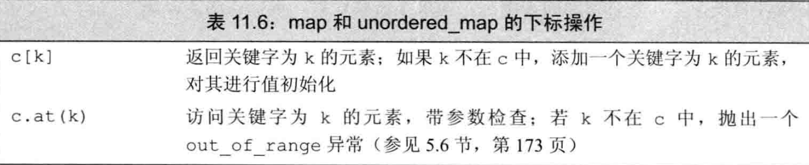
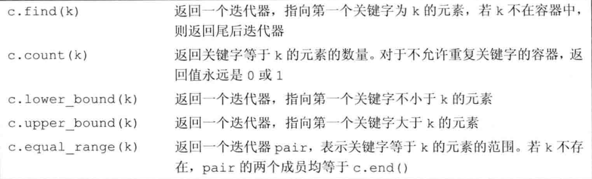
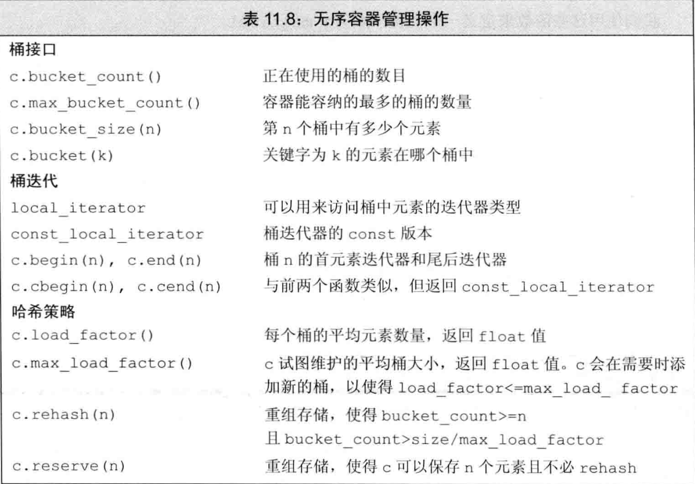

[TOC]

# 关联容器

两个主要的关联容器类型是 **map** 和 **set**。

标准库提供8个关联容器，它们之间共有三种区别：

1. **set** 或 **map**
2. 关键字能否重复
3. 是否按顺序保存元素


类型 map 和 multimap 定义在 `<map>` 中;

set 和 multiset定义在 `<set>` 中;

无序容器则分别定义在 <unordered_map> 和 <unordered_set> 中.

#### 1. 使用关联容器

---

**关联容器的迭代器都是双向的**

###### (1) map

map是 "关键字-值对" 的集合.

map 类型通常被称为**关联数组**.

与数组的区别在于其下标不必是整数.

###### (2) set

set是关键字的简单集合.

只是想知道一个值是否存在时, set 是最有用的.

###### (3) multi

具有此属性的set或map允许相同元素.

例如,对于set,它的key就是它的元素,向普通set中加入重复的key不会产生任何效果,而multiset允许加入重复的key.

#### 2.关键字类型的要求

---

关键字类型必须定义**元素比较**的方法.

默认情况下,标准库使用关键字类型的<运算符进行比较.

自定义的元素比较的方法必须在尖括号中紧跟着元素类型给出.例如: map<int ,string, comp> map;

#### 3. pair 类型

---

1. 定义在头文件`<utility>`中
2. pair是一个用来生成特定类型的模板:  pair<T1, T2>
3. pair的数据成员是 public 的,分别为 *first* 和 *second*


#### 4. 关联容器操作

---


使用作用域运算符(::)来提取一个类型的成员

#### 5. 关联容器迭代器

---

(1) **解引用一个关联容器迭代器**:

``container_type<T1...>::value_type & operator*(container_type<T1...>)``

即,返回一个value_type的值的引用.

对于map,返回的是一个pair<T1, T2>&

> [!note]
>
> 一个 map 的 value_type 是一个 pair , 我们可以改变 pair 的值, 但不能改变关键字成员的值.

(2) **set 的迭代器是 const 的**

由于 set 的 value_type 为 key , key 本身是 const 的, 所以迭代器不能修改元素的值.

(3) **遍历关联容器**

使用 begin() 和 end() 操作.

(4) 关联容器和算法

通常不对关联容器使用泛型算法,原因有:

1. 关联容器的关键字为 const ,这意味着算法无法修改 set 的元素和 map 的元素( pair )的第一个成员,所以不能用于修改或重排容器元素的算法.
2. 关联容器中的元素不能通过它们的关键字进行快速查找.使用关联容器特有的算法一般比泛型算法快得多.

> 在实际中,如果要对一个关联容器使用算法,要么是将它当作一个源序列, 要么当作一个目的位置 (dest).

#### 6. 添加元素

---

一般使用 insert() 向关联容器插入一个元素或一个范围的元素.

**茴香豆（pair 的四种创建方式：**


###### 检测 insert 的返回值

添加**单一元素**的 insert 和 emplace 返回 ``pair< 具有给定关键字的迭代器, bool (已在容器 ? return false && doing nothing : return true && 插入容器) >``

**ps : 对于multi的关联容器，仅返回指向新元素的迭代器.**

#### 7. 删除元素

---

一般使用 erase().

与顺序容器一样，可以通过传递一个迭代器或者一个迭代器对来删除一个元素或者一个元素范围.

关联容器提供一个额外的 erase 操作,接受一个 key_type 参数. 如果目标元素存在,删除之并且返回实际删除的元素的数量.


#### 8. map的下标操作

---

(1) 使用下标运算符( [] )或 at 函数.

(2) set 类型不支持下标, 因为它的元素本身就是关键字.

(3)

> [!note]
>
> 使用下标运算符时, 如果关键字并不在 map 中, 会为它**创建一个元素**并插入到 map 中, 关联值将进行值初始化.

由于上述特性,只可以对非 const 的 map 使用下标操作.

(4) 使用 at 函数较为安全, 若关键字不在 map 中, 抛出一个 out_of_range 异常，如果**只是想访问** map 中的值，最好使用 at 函数.



(4) 使用下标操作会返回一个 mapped_type 对象，这也是它与解引用操作的不同之处，解引用则会返回一个 value_type 对象.

#### 9. 访问元素

---



**(1) 对 map 使用 find 代替下标操作**

如果只是想知道关键字是否在 map 中，而不想改变 map，应该使用 find .

**(2) 在 multimap 或 multiset 中查找元素**

- **使用 find 和 count**

  ````cpp
  string search_item("Alain de Botton");  // 要查找的作者
  auto entries = authors.count(search_item);  // 元素的数量
  auto iter = authors.find(search_item);  // 此作者的第一本书
  // 用一个循环查找此作者的所有著作
  while(entries) {
      cout << iter->second << endl;  // 打印每个题目
      ++iter;  // 前进到下一本书
      --entries;  // 记录已经打印了多少本书
  }
  
  ````
- **使用 lower_bound 和 upper_bound**

  ````cpp
  // authors 和 search_item 的定义，与前面的程序一样
  // beg 和 end 表示对应此作者的元素的范围
  for (auto beg = authors.lower_bound(search_item),
            end = authors.upper_bound(search_item);
       beg != end; ++beg)
      cout << beg->second << endl;  // 打印每个题目
  
  ````
- **使用 equal_range**

  equal_range 返回一个迭代器 pair , 表示第一个匹配元素和最后一个匹配元素之间的范围(若存在).

  ````cpp
  // authors 和 search_item 的定义，与前面的程序一样
  // pos 保存迭代器对，表示与关键字匹配的元素范围
  for (auto pos = authors.equal_range(search_item);
       pos.first != pos.second; ++pos.first)
      cout << pos.first->second << endl;  // 打印每个题目
  
  ````

#### 10. 无序容器

---

**区别: 无序关联容器不是使用比较运算符来组织元素, 而是使用一个哈希函数 ( hash function ) 和关键字类型的 == 运算符.**

**(1) 使用无序容器**

除了无序之外, 无序容器的应用层面和有序容器基本相同, 而且拥有更好的平均性能.

**(2) ==管理桶==**

无序容器在存储上组织为一组桶，每个桶保存零个或多个元素。无序容器使用一个哈希函数将元素映射到桶。为了访问一个元素，容器首先计算元素的哈希值，它指出应该搜索哪个桶。容器将具有一个特定哈希值的所有元素都保存在相同的桶中。如果容器允许重复关键字，所有具有相同关键字的元素也都会在同一个桶中。因此，无序容器的性能依赖于哈希函数的质量和桶的数量和大小。

对于相同的参数，哈希函数必须总是产生相同的结果。理想情况下，哈希函数还能将每个特定的值映射到唯一的桶。但是，将不同关键字的元素映射到相同的桶也是允许的。当一个桶保存了多个元素时，需要顺序搜索这些元素来查找我们想要的那个。计算一个元素的哈希值和在桶中搜索通常都是很快的操作。但是，如果一个桶中保存了很多元素，那么查找一个特定元素就需要大量比较操作。

无序容器提供了一组管理桶的函数，如表11.8所示。这些成员函数允许我们查询容器的状态以及在必要时强制容器进行重组。



**(3) 无序容器对关键字类型的要求**

无序容器要求关键字类型拥有 == 运算符和 hash 函数，标准库为内置类型和一些标准库类型提供了 hash 模板，但是在使用自定义类型时要注意这些要求。

例如:

````cpp
size_t hasher (const Sales_data &sd) {
  return hash<string>() ( sd.isbn() );//hash<string>() 产生一个string的hash对象,调用()运算符来运算 sd.isbn() 的hash值.
}
bool eqOp (const Sales_data &lhs, const Sales_data &rhs) {
  return lhs.isbn() == rhs.isbn() ;
}

unordered_multiset<Sales_data, decltype(hasher)*, decltype(eqOp)*> bookStore (42, hasher, eqOp);//传递hash和==的函数指针
````
