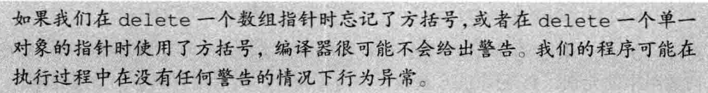
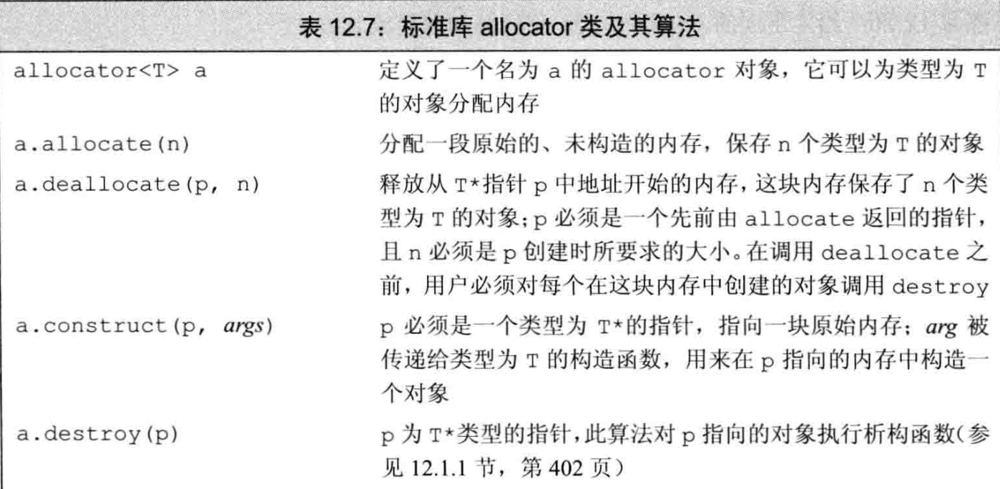

[TOC]

# 动态内存


## 一、智能指针

> 智能指针是模板.
>
> 包含在<memory>头文件中.


---


### 1. shared_ptr

````cpp
shared_ptr<string> p1;
shared_ptr<list<int>> p2;
````

1. 默认初始化的智能指针保存着一个空指针.
2. 解引用一个智能指针返回它指向的对象.


.png)

####  1.1 直接管理内存

##### 1.1.1 new 和 delete


````cpp
//对于内置类型成员
new int; // 默认初始化，值未定义
new int(); //值初始化
````


##### 1.1.2 定位new

允许传递额外参数，比如std::nothrow 


#### 1.2 结合使用


> [!WARNING]
>
> 所有权转移
>
> 

> [!WARNING]
>
> 谨慎使用get
>
> 
>
> 若使用get初始化另一个智能指针，会出现两个独立(**计数器不共享**)的 shared_ptr 指向相同的内存(**undefined behavior**)

#### 1.3 reset 用法

````cpp
if (!p.unique ()){
  p.reset (new string (*p));//不是唯一用户，更改前先拷贝自身
}
*p += newVal; //现在确保p是unique的，可以改变对象的值
````


---


### 2. 异常处理


````cpp
//反之，使用new创建的对象不会自动释放
void f(){
  int *ip = new int (53);
  /*
  ...在这期间代码抛出一场，且在f中未被捕获
  */
  delete ip; //则ip不会被释放，造成内存泄露
}
````

> 同样地，使用智能指针管理不具有良好定义的析构函数的类是一个行之有效的方法。

> [!IMPORTANT]
>
> 


---


### 3. unique_ptr


#### 3.1 使用自定义删除器

1. 使用函数对象作为删除器

   ````cpp
   #include <iostream>
   #include <memory>
   
   // 自定义删除器
   struct CustomDeleter {
       void operator()(int* ptr) const {
           std::cout << "CustomDeleter called\n";
           delete ptr;
       }
   };
   
   int main() {
       std::unique_ptr<int, CustomDeleter> u1(new int(42));  // 使用自定义删除器
       // 当 u1 离开作用域时，会调用 CustomDeleter
       return 0;
   }
   
   ````

2. 使用 lambda 表达式作为删除器

   ````cpp
   #include <iostream>
   #include <memory>
   
   int main() {
       auto deleter = [](int* ptr) {
           std::cout << "Lambda deleter called\n";
           delete ptr;
       };
   
       std::unique_ptr<int, decltype(deleter)> u2(new int(42), deleter);  // 使用 lambda 删除器
       // 当 u2 离开作用域时，会调用 lambda 删除器
       return 0;
   }
   
   ````

   

#### 3.2 所有权转移


> 另一种方法：p2 = std::move(p1)

#### 3.3 传递 unique_ptr 和返回 unique_ptr


> [!NOTE]
>
> 


---


### 4. weak_ptr


#### 4.1 lock的使用

````cpp
#include <iostream>
#include <memory>

int main() {
    std::shared_ptr<int> sp = std::make_shared<int>(42);
    std::weak_ptr<int> wp = sp;

    if (auto locked_sp = wp.lock()) {
        std::cout << "Locked shared_ptr value: " << *locked_sp << std::endl;
        std::cout << "Original shared_ptr use count: " << sp.use_count() << std::endl;
        std::cout << "Locked shared_ptr use count: " << locked_sp.use_count() << std::endl;
    } else {
        std::cout << "The managed object has been deleted." << std::endl;
    }

    // Reset the original shared_ptr
    sp.reset();

    if (auto locked_sp = wp.lock()) {
        std::cout << "Locked shared_ptr value: " << *locked_sp << std::endl;
    } else {
        std::cout << "The managed object has been deleted." << std::endl;
    }

    return 0;
}

````

`std::weak_ptr::lock` 方法会返回一个 `std::shared_ptr`，如果原对象已经被销毁，则返回一个空的 `std::shared_ptr`。如果原对象尚未被销毁，则返回一个新的 `std::shared_ptr`，这个 `shared_ptr` 和其他共享该对象的 `shared_ptr` 共享所有权。

1. **是否创建新的 `shared_ptr`？**

`std::weak_ptr::lock` 返回的 `shared_ptr` 是新创建的，但它并不代表是一个新的独立对象。相反，它是一个新的指向相同底层对象的 `shared_ptr`，因此它和已有的 `shared_ptr` 一样共享该对象的所有权。引用计数会增加，以反映新的 `shared_ptr` 对象的存在。

2. **如果不接收`lock()`返回的指针会发生什么？**

如果你调用 `wp.lock()` 而不接收返回值，那么创建的新的 `shared_ptr` 会在语句结束后立即被销毁。因为 `shared_ptr` 是一个临时对象，在不被捕获或存储的情况下，其生命周期只会持续到当前语句结束。


## 二、动态数组


### 1.  new 和数组

#### 1.1 声明方式：

1. `int * pia = new int [ size_t ] ;`

2. ````cpp
   typedef int arrT [42];
   int *p = new arrT;  //实际和方式一等效
   ````

> [!NOTE]
>
> 实际上所谓的“动态数组”并不是数组，使用new T []获得的T类型指针ptr，虽然我们可以通过ptr访问申请到的空间，但是不能对它调用  
>
> `begin`或`end`，也不能用范围 for 语句来处理动态数组中的元素。


#### 1.2 初始化：


> [!IMPORTANT]
>
> 

> [!IMPORTANT]
>
> 不能用 auto 分配数组
>
> `auto p = new auto[10](1)  //错误` 

> [!NOTE]
>
> `new T[0]`是合法的
>
> 


#### 1.3 释放动态数组

````cpp
delete [] pa; //逆序销毁，最后一个元素首先被销毁。
````

> [!WARNING]
>
> 


#### 1.4 智能指针和动态数组

> 使用 unique_ptr 管理 new 分配的数组。

````cpp
unique_ptr<int []> up (new int[10]); //注意类型为int[]
up.release(); //自动调用 delete[] 销毁
````


> shared_ptr 本质上仍是一个**单一对象的指针**，因此要使用它管理动态数组，需要**自行定义删除器**。


### 2. allocator 类

> std::allocator 类定义在头文件 memory 中，它帮助我们将**内存分配和对象构造分离**开来。它提供一种类型感知的内存分配方法，它分配的内存是原始的、未构造的。


#### 2.1 new 的局限性：

**内存分配和对象构造绑定**

1. 提前分配**并初始化**了可能不需要使用的对象。

2. 对于确实要使用的对象，在初始化时进行了默认初始化，但默认初始化往往不是我们所需要的，重复赋值造成了资源浪费。

3. > [!IMPORTANT]
   >
   > 使得没有默认构造函数的类无法动态分配数组


#### 2.2 allocator类的使用

> std::allocator 是一个模板

````cpp
allocator<string> alloc; //可以分配string的allocator对象
auto const p = alloc.allocate(n); //分配n个未初始化的string
````




#### 2.3 拷贝和填充


