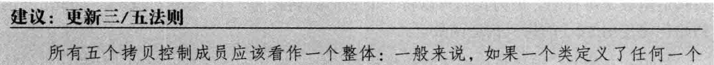

[TOC]

# 拷贝控制


**拷贝控制操作（copy control）**：

1. 拷贝构造函数
2. 拷贝赋值运算符
3. 移动构造函数
4. 移动赋值运算符
5. 析构函数

> [!WARNING]
>
> 


## 1. 拷贝构造函数


### 1.1 拷贝初始化

                                                  

**拷贝初始化发生的情况：**

1. 用 **=** 定义变量； `std::string a = "abc"; `
2. 将一个对象作为实参传递给一个非引用类型的形参
3. 从一个返回类型为非引用类型的函数返回一个对象
4. 用花括号列表初始化一个数组中的元素或一个聚合类中的成员


> [!IMPORTANT]
>
> 


> [!IMPORTANT]
>
> **三/五法则**
>
> 
> 如果一个类需要一个拷贝构造函数，几乎可以肯定它也需要一个拷贝赋值运算符，反之亦然。然而无论是需要拷贝构造函数还是需要拷贝赋值运算符都不必然意味着也需要析构函数。


> [!IMPORTANT]
>
> 


> [!IMPORTANT]
>
> 


> [!IMPORTANT]
>
> 
> ````cpp
> HasPtr& HasPtr::operator=(HasPtr rhs) {
> 	//交换左侧运算对象和局部变量 rhs 的内容（指针交换）
>   swap(*this, rhs); // rhs 现在指向本对象曾经使用的内存
>   return *this; //rhs被销毁，从而 delete 了 rhs 中的指针
> }
> ````


## 2. 对象移动


---

### 2.1 右值引用


右值引用代表着：

1. **所引用的对象将要被销毁**
2. **该对象没有其他用户**

这使得我们可以自由地接管**右值引用对象**的资源。


> [!NOTE]
>
> std::move <utility>

1. 显式地将一个**左值**转换为对应的右值引用类型

2. > [!WARNING]
   >
   > 使用 std::move 后的对象称为“移后源对象”，我们承诺了像右值一样使用它，所以除了对它进行赋值或销毁外，我们将不再使用它。

3. > [!WARNING]
   >
   > 


---

### 2.2 移动构造函数和移动赋值运算符

> 如果我们希望在**自己设计的类**使用移动操作，那么就需要为其定义移动构造函数和移动赋值运算符。

移动构造函数应确保：

1. 移后源对象必须**可析构**、**有效**（可赋值、可以安全地使用而不依赖其当前值）

   > 同样地，我们的程序也不应该依赖移后源的值，因为它是**不确定**的。

2. 一旦资源完成移动，源对象必须不再指向被移动的资源。即完成了**所有权的转移**。

````cpp
//移动构造函数
StrVec::StrVec(StrVec &&s) noexcept //不抛出任何异常
  //接管 s 中的资源
  : elements(s.elements), first_free(s.first_free), cap(s.cap)
  {
    //确保第一条：销毁无害
    s.elements = s.first_free = s.cap = nullptr;
  }
````
````cpp
//移动赋值运算符
StrVec &StrVec::operator=(StrVec &&rhs) noexcept {
  if (this != &rhs) {
    free();
    elements = rhs.elements;
    first_free = rhs.first_free;
    cap = rhs.cap;
    rhs.elements = rhs.first_free = rhs.cap = nullptr;
  }
  return *this;
}
````

> [!NOTE]
>
> **为什么移动构造函数的参数没有const？**
>
> 拷贝构造使用const的原因是它保证源对象的状态不变，而移动构造代表着**所有权的转移**，类似于"**窃取**"，移后源将失去原有资源，并且不再使用它的值。

> [!NOTE]
>
> 
>
> **前提**是它真的不会抛出异常


---

### 2.3 合成的移动操作


> [!NOTE]
>
> 

> [!note]
>
> xxxxxxxxxx8 1size_t hasher (const Sales_data &sd) {2  return hash<string>() ( sd.isbn() );//hash<string>() 产生一个string的hash对象,调用()运算符来运算 sd.isbn() 的hash值.3}4bool eqOp (const Sales_data &lhs, const Sales_data &rhs) {5  return lhs.isbn() == rhs.isbn() ;6}7​8unordered_multiset<Sales_data, decltype(hasher)*, decltype(eqOp)*> bookStore (42, hasher, eqOp);//传递hash和==的函数指针cpp
>
> 


---

### 2.4 拷贝并交换赋值运算符和移动操作

````cpp
class HasPtr {
public:
    // 添加的移动构造函数
    HasPtr(HasPtr &&p) noexcept : ps(p.ps), i(p.i) { p.ps = 0; }
    // 赋值运算符既是移动赋值运算符，也是拷贝赋值运算符
    HasPtr& operator=(HasPtr rhs)
    { 
        swap(*this, rhs); 
        return *this; 
};
````

> 当函数的形参为**非引用类型**时，需要创建一个新的对象来保存传递的参数。这个新的对象可以通过拷贝构造函数或移动构造函数来创建。如果提供了移动构造函数且传递的参数是右值或临时对象，编译器将使用移动构造函数；否则，将使用拷贝构造函数。

因此，该参数的拷贝初始化表现为——左值被拷贝，右值被移动

````cpp
hp = hp2; //拷贝构造，hp2不变
hp = std::move(hp2); //移动构造，hp2成为移后源
````

巧妙之处在于拷贝并交换（copy and swap）保证了两种情况都是安全且行为正确的。

>  [!IMPORTANT]
>
> 
>
> 


---

### 2.5 移动迭代器

> std::make_move_iterator 将一个普通迭代器转换为一个移动迭代器。

> [!CAUTION]
>
> 


> [!CAUTION]
>
> 


---

### 2.6 右值引用和成员函数

> [!NOTE]
>
> 


#### 2.6.1 引用限定符

> 引用限定符用来限定调用这个函数的对象是左值还是右值。

引用限定符可以是&或&&，分别指出`this`可以指向一个左值或右值，只能用于（非static）成员函数，且必须同时出现在函数的声明和定义中。

````cpp
class Foo {
public:
    Foo &operator=(const Foo&) &; // 只能向可修改的左值赋值
    // Foo 的其他参数
};

Foo &Foo::operator=(const Foo &rhs) & {
    // 执行将 rhs 赋予本对象所需的工作
    return *this;
}

````

> [!NOTE]
>
> 一个函数可以同时使用 const 和引用限定。但是引用限定符必须跟随在 const 之后：

````cpp
class Foo {
public:
  Foo someMem() const &; //先const再引用限定
}
````


---

### 2.7 重载和引用函数

> 引用限定符可以区分重载版本。

> [!NOTE]
>
> 如果我们定义两个或两个以上具有相同名字和相同参数列表的成员函数，就**必须对所有函数都加上引用限定符，或者所有都不加**。

````cpp
class Foo {
public:
    Foo sorted() &&;
    Foo sorted() const; // 错误：必须加上引用限定符
    // Comp 是函数类型的类型别名（参见6.7节，第222页）
    // 此函数类型可以用来比较 int 值
    using Comp = bool(const int&, const int&);
    Foo sorted(Comp*);
    Foo sorted(Comp*) const; // 正确：两个版本都没有引用限定符
};
````


---

### 2.8 图解

**拷贝构造**


**移动构造**


---

### 2.9 总结

移动构造实际上是一个高效的抽象，在具体实现中涉及到指针的拷贝和一些静态内存的拷贝。移动构造的关键在于尽可能避免昂贵的深拷贝操作，通过转移资源所有权（如指针）来实现更高效的对象管理。