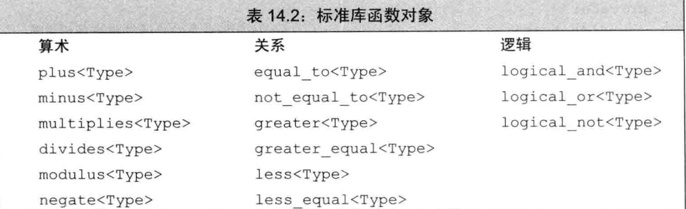
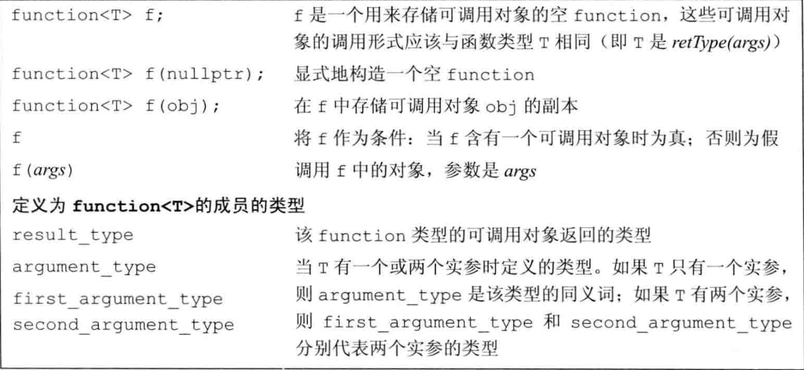

[TOC]

# 1. 重载运算


### 1.1 可重载的运算符


> [!NOTE]
>
> 


> [!NOTE]
>
> 
>
> **逻辑与、逻辑或**：短路求值属性
>
> **逗号**：求值顺序
>
> **取地址**：用于类类型对象时的特殊含义


---

### 1.2 成员函数或非成员函数


---

### 1.3 运算符介绍


#### 1.3.1 算术和关系运算符( +  -  *  / > < )

> [!NOTE]
>
> 


#### 1.3.2 相等运算符( == )


> [!NOTE]
>
> 


#### 1.3.3 赋值运算符( = )

> [!IMPORTANT]
>
> 
>
> 


#### 1.3.4 下标运算符( [ ] )

> [!IMPORTANT]
>
> 
>
> 


#### 1.3.5 递增和递减运算符(++  --)

> [!IMPORTANT]
>
> 

区分前置和后置运算符：


````cpp
StrBlobPtr operator++;      //前置
StrBlobPtr operator--;
StrBlobPtr operator++(int); //后置
StrBlobPtr operator--(int);
````

**显式调用**后置运算符

````cpp
p.operator++(0); //后置
p.operator++();  //前置
````


#### 1.3.6 成员访问运算符(*  ->)

````cpp
class StrBlobPtr {
public:
  	//解引用运算符
    std::string& operator*() const {
        auto p = check(curr, "dereference past end");
        return (*p)[curr]; // (*p)是对象所指的vector
    }
		//箭头运算符
    std::string* operator->() const {
        // 将实际工作委托给解引用运算符
        return &this->operator*();
    }
};

````

**特殊的箭头运算符**

> [!NOTE]
>
> 重载的箭头运算符必须返回类的指针或者自定义了箭头运算符的某个类的对象


#### 1.3.7 函数调用运算符()


> 如果类定义了调用运算符，则该类的对象称作**函数对象（function object）**。因为可以调用这种对象，所以我们说这些对象的“行为像函数一样”。

> 函数对象常常作为泛型算法的实参。


---

### 1.4 函数对象

> 定义了重载调用运算符的对象

#### 1.4.1 lambda是函数对象

1. lambda表达式被翻译为一个匿名类的匿名对象、该类含有一个重载的函数调用运算符。
2. 默认情况下lambda不能改变它捕获的变量，因此默认情况下函数调用运算符是一个**const成员函数**，除非它被声明为可变的。
3. 引用捕获的变量被lambda直接使用
4. 值捕获的变量被lambda**拷贝**到类内对应的数据成员中


#### 1.4.2 标准库函数对象

> 定义在 functional 头文件中



一般在算法中使用标准库函数对象，以改变算法的默认行为，或者避免**UB**：

1. `sort( svec.begin(), svec.end(), greater<string>() );  //使降序排列` 

2. `sort( PStr.begin(), PStr.end(), less<string*>() );`

   标准库规定，指针的less是定义良好的，而直接使用<是**UB**


### 1.5 std::function

> 定义在`functional`头文件中，解决了相同调用形式的可调用对象的类型冲突问题。



````cpp
// 定义一个 map，其中 key 是操作符，value 是对应的函数对象
    std::map<std::string, std::function<int(int, int)>> binops = {
        {"+", add},                                // 函数指针
        {"-", std::minus<int>()},                  // 标准库函数对象
        {"/", divide},                             // 用户定义的函数对象
        {"*", [](int i, int j) { return i * j; }}, // 未命名的 lambda
        {"%", mod}                                 // 命名了的 lambda 对象
    };
````

````cpp
//使用map中的操作符 
int a = 10, b = 2;
    std::cout << "10 + 2 = " << binops["+"](a, b) << std::endl;
    std::cout << "10 - 2 = " << binops["-"](a, b) << std::endl;
    std::cout << "10 / 2 = " << binops["/"](a, b) << std::endl;
    std::cout << "10 * 2 = " << binops["*"](a, b) << std::endl;
    std::cout << "10 % 2 = " << binops["%"](a, b) << std::endl;
````

> [!NOTE]
>
> **重载函数二义性**
>
> 虽然重载函数的调用形式不同，但是function无法确定使用者想使用形式匹配的函数还是错误地想使用形式不匹配的重载函数，所以function不能**直接**存入重载函数的名字，解决方法：
>
> 1. 传入函数指针`int (*fp)(int, int) = add;`
> 2. 使用lambda表达式`[] (int a, int b) {return add(a, b) };`


# 2. 类型转换


### 2.1 类型转换运算符

> operator **type**() const;

1. **type**表示某种**可以作为函数返回类型**的类型（除了void）
2. 必须是类的**成员函数**
3. 不能声明**返回类型**，但是有**返回值**
4. **形参列表**为空
5. 通常应该是**const函数**

> [!NOTE]
>
> 


---

### 2.2 显式类型转换（explicit）

> [!CAUTION]
>
> **显式的类型转换运算符也有可能被隐式执行**
>
> 1. 被隐式转换为**bool类型**，用于条件判断
>
> 
>
> 2. 在列表初始化时发生隐式转换

> [!NOTE]
>
> 这是一个设计决定，而不是错误，在**上下文明确**时，设计者允许为了**代码的简洁性**而隐式调用显式的类型转换运算符。

比如，标准库的io类型可以使用`while (std::cin >> value)`来读入数据直到发生异常或EOF，原因是std定义了istream向bool的**显式**类型转换，只有在这种特定情况下会隐式调用。


---

### 2.3 避免类型转换二义性

1. **不要在两个类之间建立相同的类型转换**

   比如A类中A->B的类型转换运算符，B类中A->B的构造函数。

   ````cpp
   //in class A
   operator B() const {}
   //in class B
   B(const A&);
   ````

   

2. 不要在类中定义两个及两个以上转换源或转换目标是**算术类型的转换**

   ````cpp
   A(int = 0);//转换源都是算术类型
   A(double);
   operator int() const;//转换目标都是算术类型
   operator double() const;
   
   void f2(long double);
   A a;
   f2(a); //因为无精准匹配，而且int和double转换到long double的转换级别一致，所以产生了"类型转换二义性"
   
   long lg;
   A a2(lg); //相同的原因产生了"构造二义性"
   ````

> [!IMPORTANT]
>
> 

> [!WARNING]
>
> 


---

### 2.4 函数匹配与重载运算符

> [!NOTE]
>
> 

> [!WARNING]
>
> ................................................................................................................................................................................................................................................................................................................................................................................


