[TOC]

# 面向对象程序设计


#### 1. 动态绑定

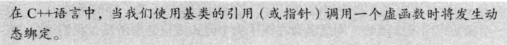

> [!NOTE]
>
> 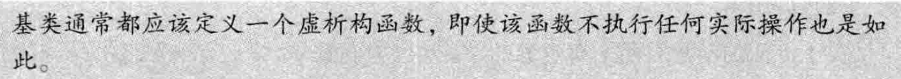

> [!NOTE]
>
> 1. 任何构造函数之外的非静态函数都可以是虚函数
> 2. virtual只能出现在类内部的声明语句之前
> 3. 虚函数的派生隐式地也是虚函数
> 4. 如果成员函数没被声明为虚函数，则其解析过程发生在**编译时**而非运行时


---

#### 2.派生类中的虚函数

````cpp
class foo {
  virtual void bar() const &;
};

class Foo : public foo {
 public:
  void bar() const & override;
  //使用override关键字显式声明进行了虚函数的覆盖
};
````


---

#### 3. 派生类的初始化

> [!NOTE]
>
> 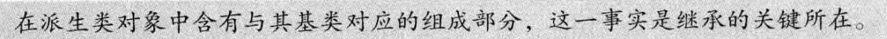
>
> 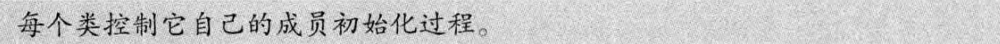
>
> 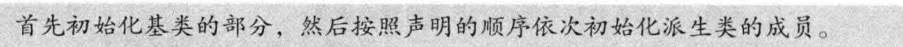
>
> 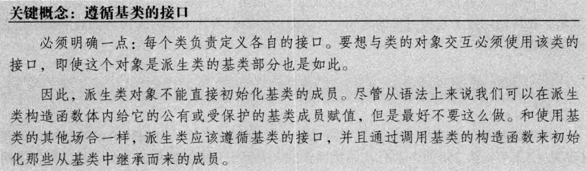


---

#### 4. 派生类的声明

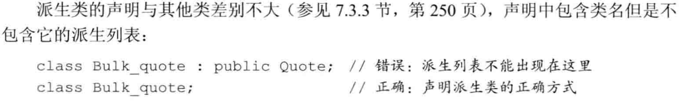

> [!NOTE]
>
> 基类必须被定义，该规定还有一层隐含的意思，即一个类不能派生它本身

> [!NOTE]
>
> C++11新标准提供了一种**防止继承发生**的方法：
>
> 在类名后跟一个关键字 **final**


---

#### 5. 类型转换与继承

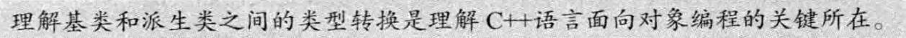

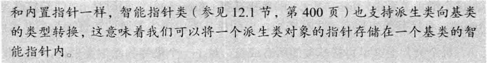

> [!NOTE]
>
> 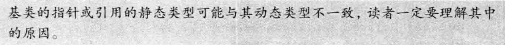

> [!WARNING]
>
> 不存在从基类向派生类的隐式类型转换

可以使用dynamic_cast请求一个类型转换，它进行运行时安全检查

````cpp
	Foo F;
  foo f;
  foo* pf = &f;
  Foo* pF = dynamic_cast<Foo*>(pf);
  if (pF != nullptr) {
    pF->bar();
  }
  else{//运行时类型检查冲突后返回nullptr
    print("pF is nullptr");
  }
````

如上，pf实际上指向一个foo对象，`dynamic_cast<Foo*>`在运行时检查会拒绝转换，返回一个`nullptr`，如果pf指向一个Foo对象，那么转换成功。

另一种方法是使用`static_cast`，`static_cast`不进行运行时检查来确认`pf`实际上指向一个`Foo`类型的对象。如果`pf`不指向`Foo`类型的对象，使用`static_cast`进行向下转换可能会导致未定义行为，例如**访问无效的内存**。

> [!warning]
>
> 对象之间的类型转换
>
> 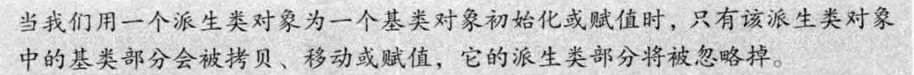
>
> 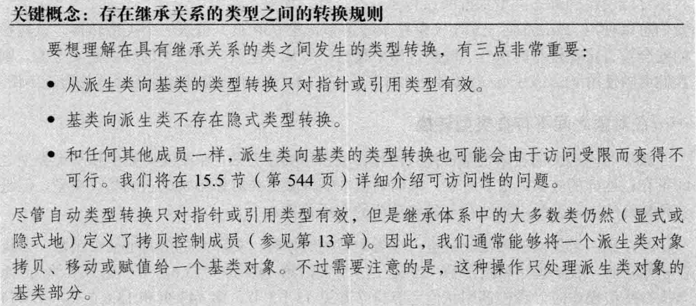


---

#### 6. 虚函数

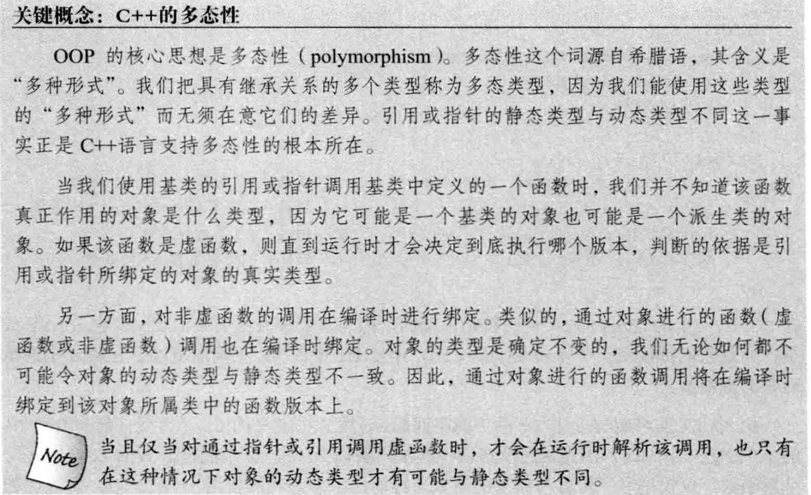

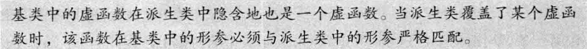

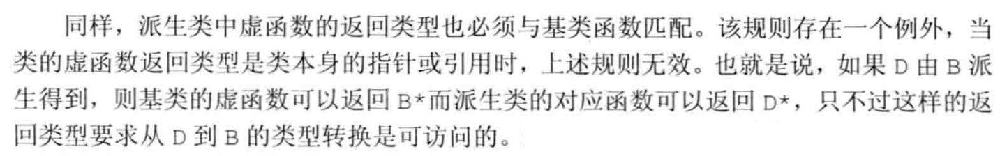

> [!NOTE]
>
> 可以在函数指定为final，禁止任何尝试覆盖该函数的操作。

````cpp
class foo {
 public:
  virtual void func(int) final {}
};

class Foo : public foo {
 public:
  void func() { print("Foo: func"); }  // 参数列表不同，不是覆盖
  // void func(int){} 报错
};
````


**默认实参**

````cpp
class foo {
 public:
  virtual void func(string param="foo") {
    print(fmt::format("foo: param:{}", param));
  }
};

class Foo : public foo {
 public:
  virtual void func(string param="Foo") {
    print(fmt::format("Foo: param: {}", param));
  }
};

void fn() {
  foo* pf=new Foo;
  pf->func();
}
````

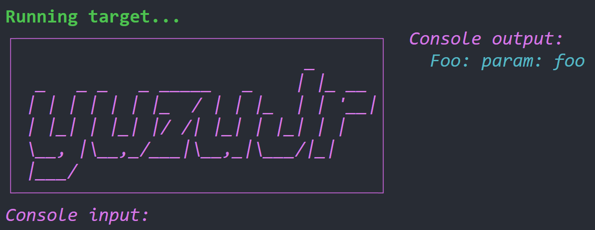

> 如果某次函数调用使用了默认实参，则该实参值由本次调用的**静态类型**决定


**回避虚函数的机制**

> [!NOTE]
>
> 使用作用域运算符 `pf->foo::func();`
>
> 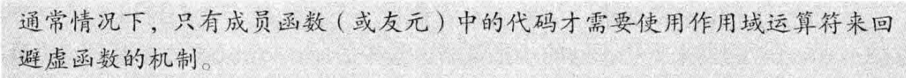

> [!WARNING]
>
> ````cpp
> class foo {
>  public:
>   virtual void recurse() {
>     print(fmt::format("foo:recurse"));
>     return;
>   }
> };
> 
> class Foo : public foo {
>  public:
>   virtual void recurse() { recurse(); }//无限递归
>   virtual void recurse() { foo::recurse(); }//正确写法
> };
> 
> void fn() {
>   foo* pf = new Foo;
>   pf->recurse();
> }
> ````
>
> 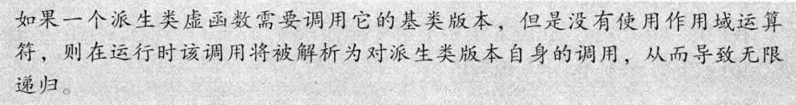


**纯虚函数**

`virtual return_type  func(args..) = 0;`

1. 含有纯虚函数的类是抽象基类

2. 不能创建抽象基类的对象


---

#### 7. 访问控制与继承


> [!IMPORTANT]
>
> **protected**
>
> **派生类的成员和友元**只能访问**派生类对象**中的基类部分的受保护成员；对于普通的基类对象中的成员不具有特殊的访问权限。


> [!NOTE]
>
> **派生类到基类转换的可访问性**
>
> 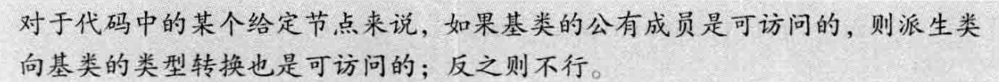


**友元**

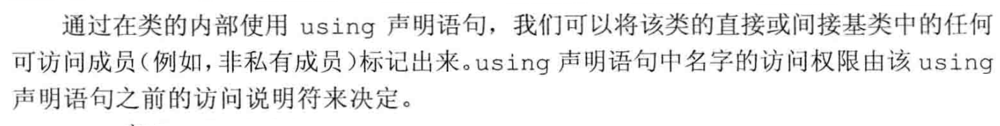

class默认私有继承，struct默认公有继承

> struct 和 class 唯一的差别就是默认成员访问说明符及默认派生访问说明符；除此之外，再无其他不同之处。

**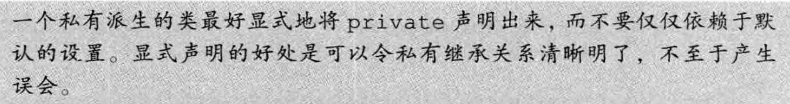**


---

#### 8. 继承中的类作用域

> [!NOTE]
>
> 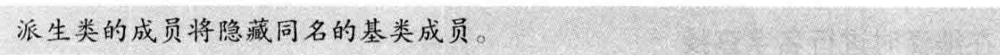
>
> 可以通过作用域运算符来使用隐藏的成员
>
> 

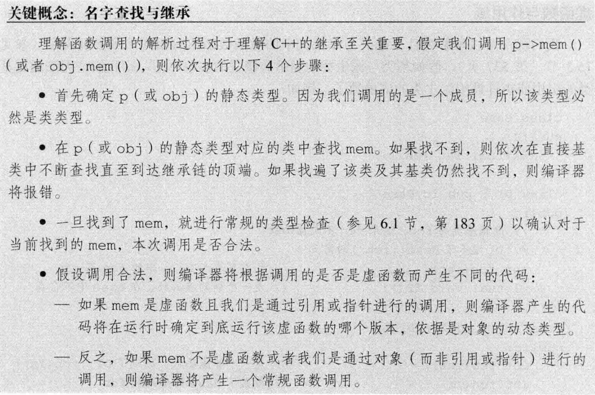

> [!important]
>
> 名字查找**先于**类型检查

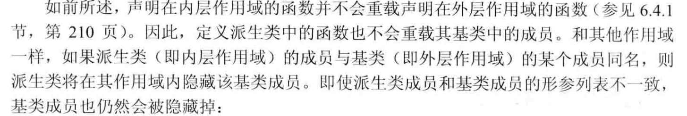

````cpp
struct Base {
    int memfcn();
};

struct Derived : Base {
    int memfcn(int); // 隐藏基类的memfcn
};

Derived d; 
Base b;

b.memfcn();          // 调用 Base::memfcn
d.memfcn(10);        // 调用 Derived::memfcn
d.memfcn();          // 错误：参数列表为空的 memfcn 被隐藏了
d.Base::memfcn();    // 正确：调用 Base::memfcn
````

> [!NOTE]
>
> `d.memfcn();`
>
> 编译器首先在Derived中查找名字`memfcn`；最先找到`memfcn(int)`,一旦名字找到，编译器就不再继续查找了，参数列表不匹配，编译器报错。

> [!NOTE]
>
> 虚函数**形参列表必须相同**的原因：
>
> 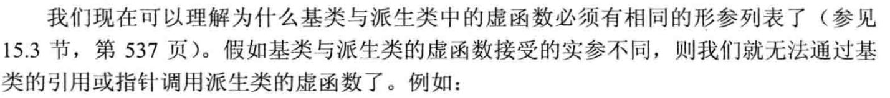


---

#### 9. 构造函数与拷贝控制

> [!WARNING]
>
> 基类通常应该定义一个虚析构函数
>
> 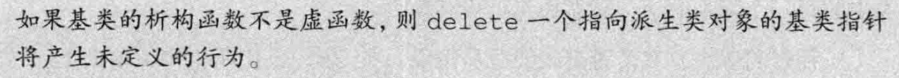

> [!NOTE]
>
> **虚析构函数将阻止合成移动操作**

> [!WARNING]
>
> 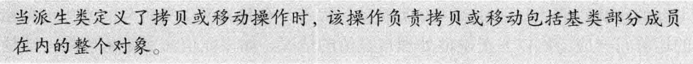

> [!WARNING]
>
> 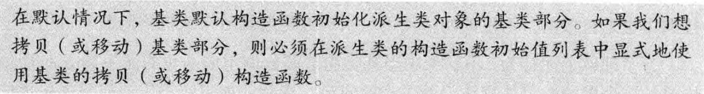

> [!NOTE]
>
> 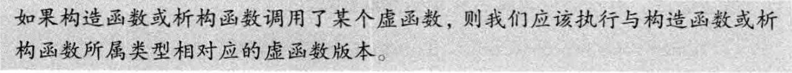

**继承的构造函数**

`using Base::Base;`

派生类自己的数据成员将被默认初始化。

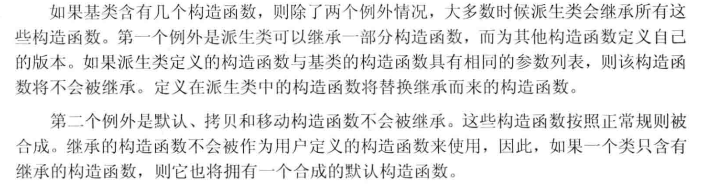


---

#### 10. 容器与继承

> [!WARNING]
>
> 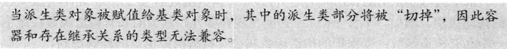

**在容器中放置（智能）指针而非对象**


