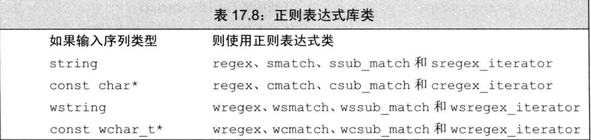
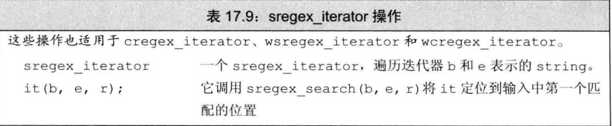
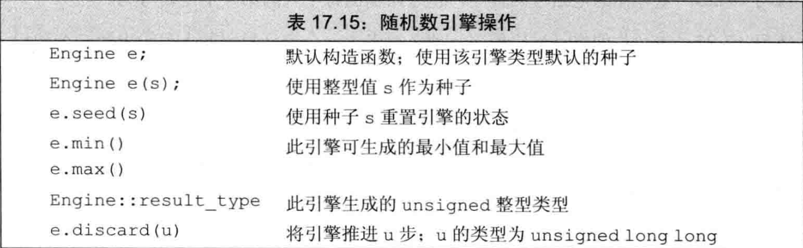
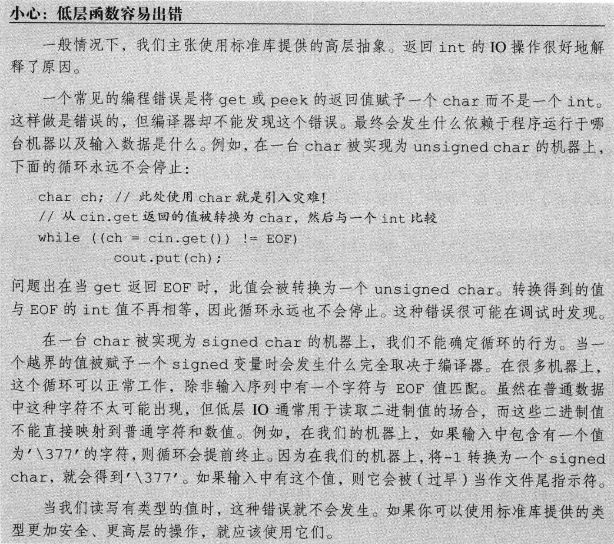

[TOC]

# 标准库特殊设施

本章将介绍4个标准库设施：`tuple`、`bitset`、随机数生成及正则表达式。此外，我们还将介绍IO库中一些具有特殊目的的部分。


## 1. `tuple`类型

> 一个`tuple`可以有任意数量的成员。当我们希望将一些数据组合成单一对象，但又不想麻烦地定义一个新数据结构来表示这些数据时，`tuple`是非常有用的。


#### 1.1 定义和初始化`tuple`

- 使用`tuple`的默认构造函数，它会对每个成员进行**值初始化**；

````cpp
tuple<size_t, size_t, size_t> threeD; //值初始化为0
````

- 为每个成员提供一个初始值。`tuple`的这个构造函数是`explicit`的，
  因此我们必须使用直接初始化语法：

````cpp
//错误，无法从initializer_list隐式转换到tuple
tuple<size_t, size_t, size_t> threeD = {1, 2, 3};
//正确
tuple<size_t, size_t, size_t> threeD{1, 2, 3};
````

- 使用`make_tuple`函数

````cpp
//使用初始值的类型推断tuple的类型
auto item = make_tuple("0-999-78345-X", 3, 20.00);
````


###### 访问`tuple`的成员

> 使用`std::get`，显式模板实参表示访问第几个成员

````cpp
auto book = get<0>(item);//0代表第一个成员
````

> [!NOTE]
>
> 尖括号内的值必须是**整形常量表达式**

> 两个类模板：tuple_size<tuple>, tuple_element<index, tuple>.

````cpp
auto item = make_tuple(1, 2.0, 'c');
typedef decltype(item) trans;//使用decltype获得tuple类型
size_t sz = tuple_size<trans>::value; //sz == 3
tuple_element<1, trans>::type ele = 1.0;//ele: double
````


###### 关系和相等运算符

> [!NOTE]
>
> `tuple`逐对比较左侧和右侧的成员
>
> 1. 成员数量必须相同
>
> 2. 对每对成员使用==运算符必须都是合法的
>
> 3. 对每对成员使用<运算符必须都是合法的
>
> 


---

#### 1.2 使用`tuple`返回多个值

综合利用上述操作即可


## 2. `bitset` 类型

> `std::bitset`使得位运算的使用更为容易，并且能够处理超过最长整型类型大小的位集合。`bitset`类定义在头文件`bitset`中。


#### 2.1 定义和初始化`bitset`

`bitset`是一个类模板，具有**固定的大小**，定义时需指定它包含多少个二进制位：

````cpp
bitset<32> bitvec(1U); //32位，低位为1，其他位为0
````


---

#### 2.2 `bitset`操作


> [!NOTE]
>
> `to_ulong` 和 `to_ullong`
>
> 


## 3. 正则表达式

> 正则表达式(regular expression) 是一种描述字符序列的方法，C++正则表达式库（RE库）是新标准库的一部分，它定义在头文件`regex`中


#### 3.1 基本使用

````cpp
// 在英语中，ei这个组合前面只能是c，否则拼写错误
// 下面查找不在字符c之后的字符串ei
  string pattern("[^c]ei"); 
  //^在这里代表非

  pattern = "[[:alpha:]]*" + pattern + "[[:alpha:]]*";
  //[[:alpha:]]代表字母，*匹配0个或多个

  regex r(pattern);//正则表达式
  string test = "receipt freind theif receive";//搜索对象
  smatch matchs;//搜索结果

  // 参数：从哪来(搜索对象)，到哪去(搜索结果)，做什么(regex)
  if (regex_search(test, matchs, r)) {
    cout << matchs.str();
  }
````

> [!NOTE]
>
> `^` 在正则表达式中的作用取决于它所处的位置：
>
> 1. **行首**：当 `^` 在正则表达式的开头时，它表示匹配字符串的开始。例如，`^abc` 表示匹配以 "abc" 开头的字符串。
> 2. **否定字符集**：当 `^` 在方括号 `[]` 内的字符集的开头时，它表示对字符集的取反（否定）。例如，`[^c]` 表示匹配任何不是 `c` 的字符。在这种情况下，`^` 的作用是将字符集中的字符进行否定。


###### 指定 regex 对象的选项


> 默认情况下，ECMAScript 标志被设置

例，**使用`icase`标志查找指定具有拓展名的文件**。大多数操作系统都是按大小写无关的方式识别扩展名的，这也是我们使用`icase`的原因。

````cpp
// 一个或多个字母或数字后接一个'.'再接"cpp"或"cc"或"cxx"
  regex r("[[:alnum:]]+\\.(cpp|cc|cxx)$", regex::icase);
  string test1 = "a.cpp";
  string test2 = "b.cc";
  smatch match;
  if (regex_search(test1, match, r)) {
    cout << match.str();
  }
  if (regex_search(test2, match, r)) {
    cout << "  " << match.str();
  }
````

> [!NOTE]
>
> - `alnum`代表字母或数字
> - `\\.`的原因: c++和regex都使用`\`作为转义字符，而`.`在regex中代表匹配任意字符，使用`\.`可以保留原意，但因为c++的原因需要使用`\\`来表示`\`
> - `$`在这里代表字符串末尾


###### 指定或使用正则表达式时的错误

> [!NOTE]
>
> 

所以如果正则表达式存在错误，则会在运行时抛出错误`std::regex_error`，

它有一个`what`操作来描述错误，一个名为`code`的成员用来返回错误代码，`code`返回的值是由具体实现定义的。


###### 正则表达式类和输入序列类型必须匹配




---

#### 3.2 匹配与 Regex 迭代器类型

> 我们可以使用`sregex_iterator`来获得所有匹配




重写扩展名匹配程序:

````cpp
// 一个或多个字母或数字后接一个'.'再接"cpp"或"cc"或"cxx"
  regex r("[[:alnum:]]+\\.(cpp|cc|cxx)", regex::icase);
  string test = "it is a1.cpp, b2.cc and c3.cxx";
  sregex_iterator it(test.begin(), test.end(), r), end_it;
  while (it != end_it) {
    println("{}", it->str());
    ++it;
  }
````

现在程序输出所有匹配项：`a1.cpp b2.cc c3.cxx`

> [!NOTE]
>
> - 空`sregex_iterator`可以当作尾后迭代器使用


###### 使用匹配数据

匹配类型有两个名为`prefix`和`suffix`的成员，分别返回表示输入序列中当前匹配之前和之后部分的`ssub_match`对象。的成员，一个`ssub_match`对象有两个名为`str`和`length`的成员，分别返回匹配的`string`和该`string`的大小。我们可以用这些操作重写语法程序的循环。

````cpp
while (it != end_it) {
    println("{}", it->prefix().str());
    println(">>>{}<<<", it->str());
    println("{}", it->suffix().str());
    ++it;
  }
````

这样程序就打印了匹配结果的上下文，还可以用`substr()`对上下文进行裁剪.

以下是更多有关`smatch`的操作：


---

#### 3.3 使用子表达式

>正则表达式中的模式通常包含一个或多个**子表达式 (subexpression)**。一个子表达式是模式的一部分，本身也具有意义。正则表达式语法通常用括号表示子表达式。

匹配对象除了提供匹配整体的相关信息外，还提供**访问模式中每个子表达式**的能力。子匹配是按位置来访问的。第一个子匹配位置为0，表示整个模式对应的匹配，随后是每个子表达式对应的匹配。

````cpp
println(">>>{}<<<", it->str(1));//将上例的输出语句稍加修改
//输出：a1 b2 c3
````


###### 子表达式用于数据验证

例：**筛选美国电话号码**

> 语法知识


> 要求:
>
> 美国的电话号码有十位数字，包含一个区号和一个七位的本地号码。区号通常放在括号里，但这并不是必需的。剩余七位数字可以用一个短横线、一个点或是一个空格分隔，但也可以完全不用分隔符。

````cpp
//让我们来分步编写这个表达式
// 1. (\\()?   //左括号
// 2. (\\d{3}) //区号
// 3. (\\))?   //右括号
// 4. ([-. ])?   //分隔符
// 5. (\\d{3}) //号码前三位
// 6. ([-. ])?   //分隔符
// 7. (\\d{4}) //号码后四位
````

下面编写代码：

````cpp
string number = "(\\()?(\\d{3})(\\))?([-. ])?(\\d{3})([-. ])?(\\d{4})";
regex r(number);
string test;
while (getline(cin, test)) {
  for (sregex_iterator it(test.begin(), test.end(), r), end_it;it != end_it; ++it) {
      if (valid(*it)) {
        println("valid: {}", it->str());
      } else {
        println("not valid: {}", it->str());
      }//if (valid(*it))
    }//for
  }//while (getline(cin, test))
````

筛选出符合regex的结果后，还要通过`valid`函数判断

- 可选的括号是否匹配
- 分隔符要么使用要么完全不使用
- 分隔符是否统一

在编写`valid`函数之前，先了解一些子匹配操作：


该操作的重点是细心讨论所有情况：

````cpp
bool valid(const smatch& m) {
  if (m[1].matched) {  // 如果有左括号
    return m[3].matched &&
           (!m[4].matched ||
            m[4].str() == " ");  
    // 那么有右括号，并且紧跟下一个号码或者一个空格
  } else {
    //否则无右括号，并且分隔符匹配
    return !m[3].matched && m[4].str() == m[6].str();
  }
}
````


---

#### 3.4 使用`regex_replace`

正则表达式也可以用来将我们**找到的序列替换为另一个序列**，继续以电话号码为例，我们可能希望电话号码的格式为`ddd.ddd.dddd`。

下面介绍有关`regex_replace`的相关操作：


为了匹配上述格式，我们只需要电话号码的第2，5，7个子表达式，即：

````cpp
// 2. (\\d{3}) //区号
// 5. (\\d{3}) //号码前三位
// 7. (\\d{4}) //号码后四位
````

替换：

````cpp
string fmt = "$2.$5.$7";//使用$提取匹配对象中的子表达式
regex r(phone);
string number = "(908) 555-1800";
println("{}",regex_replace(number, r, fmt));
````


###### 只替换输入序列的一部分

使用上面的方法可以替换一个大文件中的电话号码

````cpp
//before:
morgan (201) 555-2368 862-555-0123
drew (973)555.0130
Lee (609) 555-0132 2015550175 800.555-0000
//after:
morgan 201.555.2368 862.555.0123
drew 973.555.0130
Lee 609.555.0132 201.555.0175 800.555.0000
````

这就是正则表达式的强大之处。


###### 控制匹配和格式的标志


例，使用`format_no_copy`修改上例中的代码：

````cpp
//before:
//morgan (201) 555-2368 862-555-0123
//drew (973)555.0130
//Lee (609) 555-0132 2015550175 800.555-0000

string fmt = "$2.$5.$7\n";//  \n增加可读性
println("{}", regex_replace(test, r, fmt, regex_constants::format_no_copy));

//最终的结果更为直观了:
//201.555.2368
//862.555.0123
//973.555.0130
//609.555.0132
//201.555.0175
//800.555.0000
````

其余标志在这里不做展开。


**练习 17.26**

````cpp
int main() {
  //r为regex
  //input为读入的一行数据
  
    std::sregex_iterator it(input.begin(), input.end(), r), end_it;
  
    // 使用std::distance计算匹配的电话号码数量
    int count = std::distance(it, end_it);

    // 重新初始化迭代器
    it = std::sregex_iterator(input.begin(), input.end(), r);

    // 遍历匹配结果并输出
    for (int i = 0; it != end_it; ++it, ++i) {
        if (count == 1 || i > 0) {
            std::cout << it->str() << std::endl;
        }
    }
  //如果只有一个电话号码，输出它；
  //如果有多个电话号码，只输出第二个及其后面的电话号码。
    return 0;
}
````

> [!NOTE]
>
> - `std::distance`基于`operator++`获得两迭代器之间的距离
> - 由于 `std::distance` 已经耗尽了迭代器，需要重新初始化它。


## 4. 随机数

rand函数有一些问题:

- 不同范围的随机数

- 非均匀分布的数

而程序员为了解决这些问题而试图转换rand生成的随机数的范围、类型或分布时，常常会引入**非随机性**。

定义在头文件`random`中的随机数库通过一组协作的类来解决这些问题：**随机数引擎类(random-number engines)**和**随机数分布类(random-number distribution)**。


> [!NOTE]
>
> 


---

#### 4.1 随机数引擎和分布

随机数引擎是**函数对象类**，”调用“它返回一个随机`unsigned`整数

`default_random_engine`实际上是一个类型别名，它一般是最通用的随机数引擎，在`gcc-std`中它实际是:`linear_congruential_engine`

````cpp
default_random_engine e;
print("{}",e());
````




###### 分布类型与引擎

````cpp
default_random_engine e;
uniform_int_distribution u(0, 9);
for (size_t i = 0; i < 10; ++i) {
  print("{}", u(e));
}
````

> [!NOTE]
>
> 

> [!WARNING]
>
> 


###### 使用时间种子


> [!WARNING]
>
> 


---

#### 4.2 其他随机数分布


###### 生成随机实数

````cpp
uniform_real_distribution <default=double> u(0, 1);
````


###### 生成非均匀分布的随机数

> 正态分布 normal_distribution<default=double>

````cpp
default_random_engine e;
normal_distribution<> u(4, 1.5);
vector<unsigned> vals(9);
for (size_t i = 0; i < 200; ++i) {
  ++vals.at(lround(u(e)));
}
for (size_t i = 0; i < vals.size(); i++) {
  println("{}: {}", i, string(vals[i],'*'));
}
````


> 伯努利分布 `bernoulli_distribution`

普通类，返回`bool`值，默认`true`和`false`的概率各为0.5。接受一个参数_p指定返回`true`的概率。

> [!WARNING]
>
> 

> [!NOTE]
>
> 更多的分布模板在[附录](##6. 附录)中


## 5. IO库再探


#### 5.1 格式化输入与输出


###### 使用操纵符（manipulator）

> [!NOTE]
>
> 很多操纵符改变格式状态
>
> 
>
> 通常最好在不再需要特殊格式时尽快将流恢复到默认状态。

- 控制**布尔值**的格式

  ````cpp
  cout << boolalpha << true << noboolalpha << endl;
  //默认打印0/1，使用boolalpha后打印true/false，打印后使用
  //noboolalpha还原。
  ````

- 指定**整型值**的进制

  ````cpp
  /* hex: 16进制
     oct: 8进制
     dec: 10进制
  */
  ````

  > [!NOTE]
  >
  > 

  >  [!NOTE]
  >
  >  使用`showbase`在输出中显示进制，`noshowbase`还原
  >
  >  - 前导0x表示十六进制。
  >  - 前导0表示八进制。
  >  - 无前导字符串表示十进制。

	> [!NOTE]
	>
	> 使用`uppercase`输出大写十六进制数，`nouppercase`还原

- 控制**浮点数**格式

  - 指定**打印精度**

    使用`precision`成员或`setprecision`操纵符

    > [!NOTE]
    >
    > 

  - 指定**浮点数计数法**
  
    - `scientific`：科学计数法
    - `fixed`：定点十进制
    - `hexfloat`：十六进制
    - `defaultfloat`：恢复默认状态

  - 打印**小数点**
  
    `showpoint`强制打印小数点，`noshowpoint`恢复
    
  - **输出补白**
  
    - `setw`指定下一个数字或字符串值的最小空间。
  
    - `left`表示左对齐输出。
  
    - `right`表示右对齐输出，右对齐是默认格式。
  
    - `internal`控制负数的符号的位置，它左对齐符号，右对齐值，用空格填满所有中间空间。
  
    - `setfill`允许指定一个字符代替默认的空格来补白输出。
  
      > [!NOTE]
      >
      > 


###### 控制输入格式

`noskipws`令`cin`读取空白符，`skipws`恢复


---

#### 5.2 未格式化的输入/输出操作

> 未格式化的输入/输出操作允许我们将一个流当作一个无解释的字节序列来处理。

###### 单字节操作


> [!NOTE]
>
> 一般情况下，在读取下一个值之前，标准库保证我们**可以退回最多一个值**。即，标准库不保证在中间不进行读取操作的情况下能连续调用`putback`或`unget`。

> [!NOTE]
>
> 返回`int`值的原因
>
> 这些函数返回一个int的原因是：可以**返回文件尾标记**。我们使用char范围中的每个值来表示一个真实字符，因此，取值范围中没有额外的值可以用来表示文件尾。


###### 多字节操作


> [!WARNING]
>
> 
>
> 比如使用get获取一行，但是换行符还在流中。

> [!NOTE]
>
> 应该在任何后续未格式化输入操作之前调用`gcount`。
>
> 


---

#### 5.3 流随机访问

> [!NOTE]
>
> 

> [!WARNING]
>
> 


###### seek和tell函数


> [!NOTE]
>
> 只有一个标记
>
> 


## 6. 附录


#### 6.1 随机数分布


#### 6.2 随机数引擎


