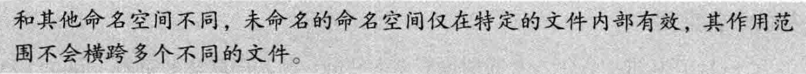
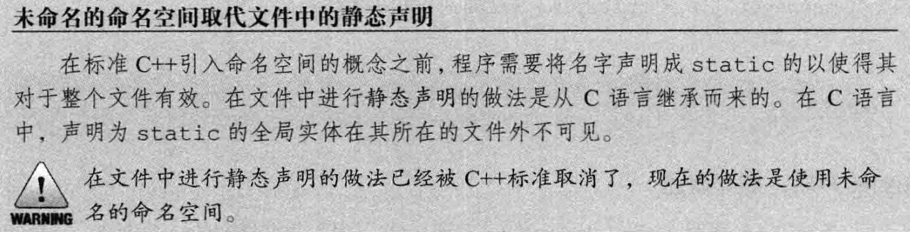

[TOC]

# 用于大型程序的工具


## 1. 异常处理

> **异常处理(exception handling)**机制允许程序中独立开发的部分能够在运行时就出现的问题进行通信并做出相应的处理。异常使得我们能够将问题的检测与解决过程分离开来。**程序的一部分负责检测问题的出现，然后解决该问题的任务传递给程序的另一部分**。检测环节无须知道问题处理模块的所有细节，反之亦然。


#### 1.1 抛出异常

当执行一个`throw`时：

- 沿着调用链的函数可能会提早退出。
- 一旦程序开始执行异常处理代码，则沿着调用链创建的对象将被销毁。


###### 栈展开

简而言之就是在包含`throw`语句的`try语句块`中找与之关联的`catch`子句，如果没找到就继续沿栈返回（调用逆序）寻找，这个过程被称为**栈展开（stack unwinding）**。

假设找到了一个匹配的catch子句，则程序进入该子句并执行其中的代码。当执行完这个catch子句后，找到**与try块关联的最后一个catch子句**之后的点，并从这里继续执行。

> try块可以关联多个catch子句

如果一直没找到匹配的`catch`，退出`main`函数后查找过程终止，程序将调用标准库函数`terminate`，终止程序。

> [!NOTE]
>
> 


###### 栈展开过程中对象被自动销毁

这意味着类类型的析构函数会自动调用，这里有一个隐含前提。

 **析构函数不应该抛出不能被它自身处理的异常**

1. 如果析构函数抛出异常，则**异常点之后的程序不会执行**，如果析构函数在异常点之后执行了某些必要的动作比如释放某些资源，则这些动作不会执行，会造成诸如**资源泄漏**的问题。

2. 通常异常发生时，c++的机制会调用已经构造对象的析构函数来释放资源，此时若析构函数本身也抛出异常，则前一个异常尚未处理，又有新的异常，会造成**程序崩溃**的问题。

> [!WARNING]
>
> 


###### 异常对象

1. 编译器对异常对象进行拷贝初始化，所以`throw`语句中的表达式必须拥有**完全类型**。
2. 如果是类类型，则相应的类必须含有一个**可访问的析构函数**和一个**可访问的拷贝或移动构造函数**。
3. 数组类型或函数类型将被转换为对应的指针类型。
4. 不应抛出指向**局部对象的指针**。
5. 异常对象的类型取决于表达式的**静态编译时类型**

> [!WARNING]
>
> 


---

#### 1.2 捕获异常

1. 异常声明可以是左值引用，但不能是右值引用
2. 通常情况下，如果`catch`接受的异常与某个继承体系有关，则最好将`catch`的参数定义成引用类型
3. 静态类型决定`catch`语句所能执行的操作


###### 查找匹配的处理代码

在搜寻catch语句的过程中，挑选出来的应该是第一个与异常匹配的catch语句。因此，**越是专门的`catch`越应该置于整个`catch`列表的前端**。

绝大多数类型转换都不被允许：

- 允许从非常量向常量的类型转换，也就是说，一条非常量对象的throw语句可以匹配一个接受常量引用的catch语句。
- 允许从派生类向基类的类型转换。
- 数组被转换成指向数组（元素）类型的指针，函数被转换成指向该函数类型的指针。

> [!NOTE]
>
> 


###### 重新抛出

在`catch`语句中使用`throw;`

````cpp
catch (my error &eobj) {  //引用类型
  eobj.status = errCodes::severeErr;  //修改了异常对象
  throw;  //异常对象的status成员是severeErr
} catch (other error eobj) {  //非引用类型
  eobj.status = errCodes::badErr;  //只修改了异常对象的局部副本
  throw;  //异常对象的status成员没有改变
}
````


###### 捕获所有异常的处理代码

`catch(...)`称为**捕获所有异常（catch all）**

````cpp
try {
    throw 1;
  } catch (std::exception) {
    print("caught an exception");
  } catch (...) {
    print("caught 1");
  }
//output: caught 1
````

> [!NOTE]
>
> 


---

#### 1.3 函数`try`语句块与构造函数

> [!NOTE]
>
> 

为处理构造函数初始值列表中抛出的异常，我们必须将构造函数写成**函数`try`语句块**（也称为函数测试块，function try block）。

````cpp
foo::foo(int i) try:data(i) {
  
} catch(const std::exception &e){
  handle(e);
}
````

> 还有一种情况值得读者注意，在**初始化构造函数的参数时**也可能发生异常，这样的异常不属于函数`try`语句块的一部分。函数`try`语句块只能处理构造函数开始执行后发生的异常。和其他函数调用一样，如果在参数初始化的过程中发生了异常，则该异常属于**调用表达式的一部分**，并将在调用者所在的上下文中处理。


---

#### 1.4 `noexcept`异常说明

1. 对于一个函数来说，`noexcept`说明要么出现在该函数的**所有声明语句和定义语句中**，要么一次也不出现。

2. 该说明应该在函数的尾置返回类型之前。

3. 我们也可以在函数指针的声明和定义中指定`noexcept`.。在typedef或类型别名中则不能出现`noexcept`。

4. 在成员函数中，`noexcept`说明符需要跟在const及引用限定符之后，而在final、override或虚函数的=0之前。

   > 复习：**引用限定符**（&）用来限定调用这个函数的对象是左值还是右值。

   ````cpp
   virtual void foo() const && noexcept final{}
   //修饰符参考顺序
   ````

`noexcept`可以用在两种情况下：

- 确认函数不会抛出异常
- 不知道该如何处理异常

> [!WARNING]
>
> 通常情况下，编译器不能也不必在编译时验证异常说明。如果声明为`noexcept`的函数抛出了异常，程序会调用`terminate`终止，以确保不在**运行时**抛出异常的承诺。对是否执行栈展开未做约定。


###### 异常说明的实参

`noexcept`说明符接受一个可选的实参，该实参必须能转换为`bool`类型：如果实参是`true`,则函数不会抛出异常：如果实参是`false`,则函数可能抛出异常：

````cpp
void recoup(int) noexcept(true);//recoup不会抛出异常
void alloc(int) noexcept(false);//a11oc可能抛出异常
````


###### `noexcept`运算符

`noexcept`运算符是一个一元运算符，它的返回值是一个`bool`类型的右值常量表达式，用于表示给定的表达式是否会抛出异常。和`sizeof`类似，`noexcept`也不会求其运算对象的值。

> [!NOTE]
>
> 


###### 异常说明与指针、虚函数和拷贝控制

**指针：**

函数指针及该指针所指的函数必须具有一致的异常说明。也就是说，如果我们为某个指针做了不抛出异常的声明，则该指针将只能指向不抛出异常的函数。相反，如果我们显式或隐式地说明了指针可能抛出异常，则该指针可以指向任何函数，即使是承诺了不抛出异常的函数也可以：

````cpp
//recoup和pf1都承诺不会抛出异常
void (*pfl)(int) noexcept = recoup;
//正确：recoup不会抛出异常，pf2可能抛出异常，二者之间互不干扰
void (*pf2)(int) = recoup;
pf1 = alloc;
//错误：alloc可能抛出异常，但是pf1已经说明了它不会抛出异常
pf2 = alloc;
//正确：pf2和alloc都可能抛出异常
````

**虚函数：**

如果一个虚函数承诺了它不会抛出异常，则后续派生出来的虚函数也必须做出同样的承诺：与之相反，如果基类的虚函数允许抛出异常，则派生类的对应函数既可以允许抛出异常，也可以不允许抛出异常。

**拷贝控制**：

当编译器合成拷贝控制成员时，同时也生成一个异常说明。如果对所有成员和基类的所有操作都承诺了不会抛出异常，则合成的成员是`noexcept`的。如果合成成员调用的任意一个函数可能抛出异常，则合成的成员是`noexcept(false)`。而且，如果我们定义了一个析构函数但是没有为它提供异常说明，则编译器将合成一个。合成的异常说明将与假设由编译器为类合成析构函数时所得的异常说明一致。


---

#### 1.5 异常类层次


## 2. 命名空间


#### 2.1 命名空间定义

> [!NOTE]
>
> 

````cpp
namespace {
  ...
}
````

###### 每个命名空间都是一个作用域

和其他作用域类似，命名空间中的每个名字都必须表示该空间内的唯一实体。因为不同命名空间的作用域不同，所以在不同命名空间内可以有相同名字的成员。

###### 命名空间可以是不连续的

参考std命名空间

> [!NOTE]
>
> 

###### 模板特例化


###### 全局命名空间

````cpp
::member_name;
````

###### 嵌套的命名空间

````cpp

namespace cpp {
  namespace cpp98 {//普通嵌套
    //使用cpp98的内容需要使用cpp::cpp98::name;
  }
  inline namespace cpp23{//内联嵌套
    //cpp命名空间内可以直接访问cpp23内容 cpp::name;
  }
}
````

###### 未命名的命名空间

- 变量具有静态生命周期
- 不能跨文件
- 名字可以直接使用
- 作用域与该命名空间所在的作用域相同

> [!NOTE]
>
> 

> [!WARNING]
>
> 


---

#### 2.2 使用命名空间成员


###### 命名空间的别名

````cpp
namespace primer = cplusplus_priemr;
````

> [!NOTE]
>
> 

###### using声明（declaration）

````cpp
using std::string;
````

###### using指示（directive）

````cpp
using namespace std;
````

> [!WARNING]
>
> 


---

#### 2.3 类、命名空间与作用域

> [!NOTE]
>
> 

###### 实参相关的查找与类类型形参

````cpp
std::string s;
std::cin >> s;
````

思考上面的代码，我们可能已经对>>（输入运算符）习以为常，string 在std中重载了该运算符用于输入一个字符串，这个调用等价于`operator>>(std::cin,s);`，那么问题是，**为什么我们不显式使用`std::`限定符就可以调用`operator>>`？**

对于命名空间中名字的隐藏规则来说有一个**重要的例外**，它使得我们可以直接访问输出运算符。这个例外是，当我们给**函数**传递一个**类类型的对象**时，除了在常规的作用域查找外还会查找实参**类所属的命名空间**。这一例外对于传递类的引用或指针的调用同样有效。


###### 友元声明与实参相关的查找


---

#### 2.4 重载与命名空间


###### 与实参相关的查找与重载

编译器在每个实参类(以及实参类的基类)所属的命名空间中搜寻候选函数。在这些命名空间中所有与被调用函数同名的函数都将被添加到候选集当中，即使其中某些函数在调用语句处不可见也是如此：

例如：

假设你定义了一个与标准库名字冲突的函数`print`，你为了不报错而没有使用`using namespace std;`，奇怪的是，给它传递一个非std内定义的参数时没有问题，但是一旦传递类似`std::string`这样的参数就会发生调用冲突，原因就是实参所在的命名空间查找，把`std::print`也纳入了候选函数，如果没有更好的匹配就会产生二义性。


###### 重载与 using 声明/指示

一个`using`声明引入的函数将重载该声明语句所属作用域中已有的其他同名函数。如果`using`声明出现在局部作用域中，则引入的名字将隐藏外层作用域的相关声明。如果`using`声明所在的作用域中已经有一个函数与新引入的函数同名且形参列表相同，则该`using`声明将引发错误。除此之外，`using`声明将为引入的名字添加额外的重载实例，并最终扩充候选函数集的规模。

与`using`声明不同的是，对于`using`指示来说，引入一个与已有函数形参列表完全相同的函数并不会产生错误。此时，只要我们指明调用的是命名空间中的函数版本还是当前作用域的版本即可。


## 3. 多重继承与虚继承


#### 3.1 多重继承

###### 多重继承的派生类从每个基类中继承状态


###### 派生类构造函数初始化所有基类

- **基类的构造顺序与派生列表中基类的出现顺序保持一致**，而与派生类构造函数初始值列表中基类的顺序无关。
- 以上图为例，初始化顺序为**`ZooAnimal` -> `Bear` -> `Endangered` -> `Panda`**。 


###### 继承的构造函数与多重继承

在C+11新标准中，允许派生类从它的一个或几个基类中继承构造函数。但是如果从多个基类中继承了相同的构造函数（即形参列表完全相同），则程序将产生错误，则这个类必须为该构造函数定义它自己的版本。


###### 析构函数与多重继承

- 派生类的析构函数只负责清除派生类本身分配的资源。
- 析构函数调用顺序与构造函数相反。


###### 多重继承的派生类的拷贝与移动操作

与只有一个基类的继承一样，多重继承的派生类如果定义了自己的拷贝/赋值构造函数和赋值运算符，则必须在完整的对象上执行拷贝、移动或赋值操作。


---

#### 3.2 类型转换与多个基类

> [!NOTE]
>
> 编译器不会在派生类向基类的几种转换中进行比较和选择，因为在它看来转换到任意种基类都一样好。


###### 基于指针类型或引用类型的查找

与只有一个基类的继承一样，对象、指针和引用的**静态类型**决定了我们能够使用哪些成员。


---

#### 3.3 多重继承下的类作用域

>派生类的作用域嵌套在直接基类和间接基类的作用域中。

在多重继承的情况下，相同的查找过程在所有直接基类中同时进行。如果名字在多个基类中都被找到，则对该名字的使用将具有二义性。

> [!WARNING]
>
> 

> 名字查找先于类型检查

即使形参列表不同、访问控制不同也有可能发生错误，因为名字查找先于类型检查，当编译器在两个作用域同时发现这个名字时，将直接报告一个调用二义性的错误。

要想避免潜在的二义性，最好的办法是**在派生类中为该函数定义一个新版本**。


---

#### 3.4 虚继承

在C++语言中我们通过**虚继承(virtual inheritance)**的机制解决多次继承的问题。虚继承的目的是令某个类做出声明，承诺愿意共享它的基类。其中，共享的基类子对象称为**虚基类 virtual base class)**。在这种机制下，不论虚基类在继承体系中出现了多少次，在派生类中都只包含唯一一个共享的虚基类子对象。


如图，Panda同时继承自Bear和Raccoon，而Bear和Raccoon都是`ZooAnimal`的子类，我们通过虚继承解决了对`ZooAnimal`的多次继承。

> [!NOTE]
>
> 


###### 使用虚基类

使用方法：

````cpp
class Raccoon : public virtual ZooAnimal { /* ... */ };
class Bear : virtual public ZooAnimal { /* ... */ };
//virtual 和 访问控制符 顺序任意
````

- **支持向基类的常规类型转换**

- **虚基类成员的可见性**

  - 如果在D1和D2中都没有x的定义，则x将被解析为B的成员，此时不存在二义性，一个D的对象只含有x的一个实例。

  - 如果×是B的成员，同时是D1和D2中某一个的成员，则同样没有二义性，派生类的x比共享虚基类B的x优先级更高。

  - 如果在D1和D2中都有×的定义，则直接访问×将产生二义性问题。

  与非虚的多重继承体系一样，最好的解决办法是在派生类中为成员自定义新的实例。


---

#### 3.5 构造函数与虚继承

> 在虚派生中，虚基类是由最底层的派生类初始化的。


###### 虚继承的对象的构造方式

含有虚基类的对象的构造顺序与一般的顺序稍有区别：首先使用提供给最低层派生类构造函数的初始值初始化该对象的虚基类子部分，接下来按照直接基类在派生列表中出现的次序依次对其进行初始化。

> [!NOTE]
>
> 


###### 构造函数与析构函数的次序


