[TOC]

# 特殊工具与技术


````cpp
goto https;
	https://baidu.com
//真是幽幽又默默啊
````


## 1. 控制内存分配


#### 1.1 重载`new`和`delete`


###### `new`和`delete`的工作机理

**operator new**

1. 分配一块足够大的、原始的、未命名的内存空间以便存储特定类型的对象（或者对象的数组）。
2. 编译器运行相应的构造函数以构造这些对象，并为其传入初始值。
3. 对象被分配了空间并构造完成，返回一个指向该对象的指针。

**operator delete**

1. 对指针所指的对象或者数组中的元素执行对应的析构函数。
2. 编译器调用名为operator delete(或者operator delete[])的标准库函数释放内存空间。

> [!WARNING]
>
> 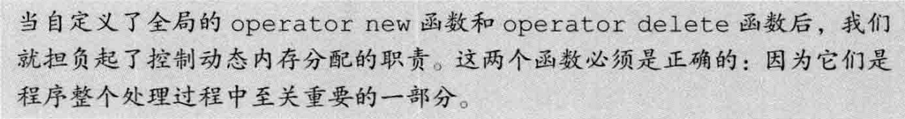

`new`和`delete`函数的查找过程和其他重载函数类似，可以在全局作用域中定义。


###### `operator new`接口和`operator delete`接口

````cpp
//这些版本可能抛出异常
void *operator new(size_t);//分配一个对象
void *operator new[](size_t);//分配一个数组
void *operator delete(void*) noexcept;//释放一个对象
void *operator delete[](void*) noexcept;//释放一个数组

//这些版本承诺不会抛出异常
void *operator new(size_t,nothrow_t&) noexcept;
void *operator new[](size_t,nothrow_t&) noexcept;
void *operator delete(void*,nothrow_t&) noexcept;
void *operator delete[](void*,nothrow_t&) noexcept;
````

- `nothrow_t`是定义在`new`头文件中的一个`struct`, 在这个类型中不包含任何成员, `new`头文件还定义了一个名为`nothrow`的`const`对象, 可以使用`new(nothrow)`请求`new`的非抛出版本.
- `operator delete`不允许抛出异常, 重载时需指定`noexcept`.
- `new`和`delete`运算符默认为`static`的, 且不能操纵类的任何数据成员.
- 返回类型必须是`void*`, 第一个形参必须是`size_t`且不能含有默认实参.
- 可以为`operator new`提供额外的形参, 但是有一个例外永远不能被用户重载: `void *operator new (size_t, void*)`.


- `operator delete`返回类型必须是`void`, 第一个形参类型必须是`void*`.
- 作为类的成员时, 可以包含另外一个类型为`size_t`的形参, 表示对象的字节数.

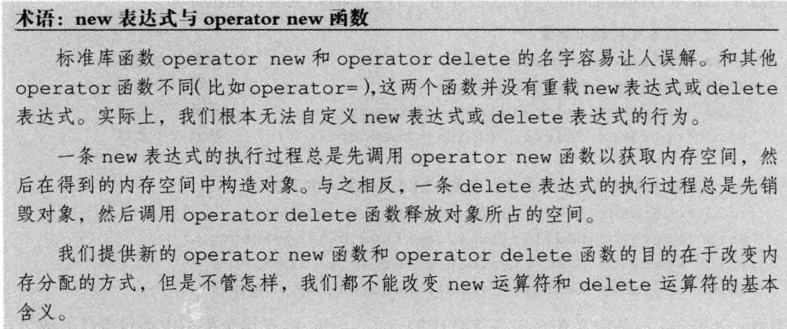


---

#### 1.2 定位`new`表达式

与`allocator`不同的是，对于`operator new`分配的内存空间来说我们无法使用`construct`函数构造对象。相反，我们应该使用new的**定位new     (placement new)**形式构造对象。如我们所知，new的这种形式为分配函数提供了额外的信息。我们可以**使用定位new传递一个地址**，此时定位new的形式如下所示：

````cpp
new (address) type
new (address) type (initializers)）
new (address) type [size]
new (address) type [size] {braced initializer list}
````

> [!NOTE]
>
> 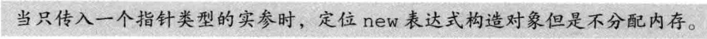

`operator new(size_t, void*)`实际上不分配任何内存，因为我们已经给他提供了一个指针，它返回这个指针，`new`表达式在指定的地址初始化对象。

实际上，传给定位`new`表达式的指针甚至不需要指向动态内存：

````cpp
int a=1;
new(&a) int(2);
print("{}",a);
//a的值变为2
//这是一个危险的操作，我们直接在栈内存上使用new构造了一个int对象并且覆盖了原有的a
````


###### 显式的析构函数调用

````cpp
string *sp = new string("hello");
sp->~string();
````

> [!NOTE]
>
> 


## 2. 运行时类型识别

**运行时类型识别(run-time type identification,RTTI) **的功能由两个运算符实现：

- `typeid`运算符，用于返回表达式的类型。
-  `dynamic_cast`运算符，用于将基类的指针或引用安全地转换成派生类的指针或引用。

> 这两个运算符特别适用于以下情况：我们想**使用基类对象的指针或引用执行某个派生类操作并且该操作不是虚函数**。一般来说，只要有可能我们应该尽量使用虚函数。当操作被定义成虚函数时，编译器将根据对象的动态类型自动地选择正确的函数版本。然而，并非任何时候都能定义一个虚函数。假设我们无法使用虚函数，则可以使用一个RTTI运算符。另一方面，与虚成员函数相比，使用RTTI运算符蕴含着更多潜在的风险：程序员必须清楚地知道转换的目标类型并且必须检查类型转换是否被成功执行。

> [!WARNING]
>
> 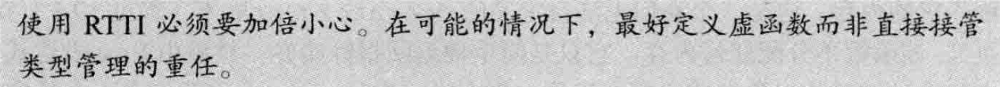


#### 2.1 dynamic_cast 运算符

````cpp
dynamic_cast<type*>(e);
dynamic_cast<type&>(e);
dynamic_cast<type&&>(e);
````

在转换时进行运行时类型检查，比如，如果一个基类指针指向派生类对象，那么可以使用`dynamic_cast`转换为派生类指针，如果实际指向基类对象，那么通过运行时类型检查，转换将会失败。

必须满足三个条件之一：

1. e 的类型是`type`的共有派生类
2. e 的类型是`type`的共有基类
3. e 的类型就是`type`的类型

如果失败：

- 指针类型调用返回0
- 引用类型调用抛出一个`bat_cast`异常


###### 指针类型的`dynamic_cast`

> [!NOTE]
>
> 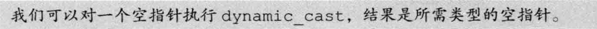

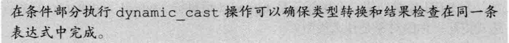

````cpp
if (Derived *dp = dynamic_cast<Derived*>(bp)) {
//使用dp指向的Derived对象
} else {
//使用bp指向的Base对象
}
````


###### 引用类型的`dynamic_cast`

````cpp
void f(const Base &b) {
  try {
    const Derived& d = dynamic_cast<const Derived&>(b);
  } catch(std::bad_cast) {
    //处理类型转换失败的情况
  }
}
````


---

#### 2.2 `typeid`运算符

- `typeid`运算符可以作用于任意类型的表达式。
- 和往常一样，顶层const被忽略。
- 如果表达式是一个引用，则`typeid`返回该引用所引对象的类型。
- 当`typeid`作用于数组或函数时，并不会执行向指针的标准类型转换。
- 当运算对象不属于类类型或者是一个不包含任何虚函数的类时，`typeid`运算符指示的是运算对象的静态类型。
- 当运算对象是定义了至少一个虚函数的类的左值时，`typeid`的结果直到运行时才会求得。

> [!WARNING]
>
> 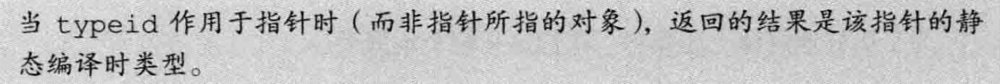

- 只有当类型含有虚函数时，需要运行时检查，编译器才会对表达式求值。

- 如果触发了运行时求值，而表达式是空指针，将抛出一个`bad_typeid`异常。


---

#### 2.3 使用RTTI实现继承类的相等运算符

````cpp
friend bool operator==(const Base &lhs,const Base &rhs) {
//如果typeid不相同，返回false;否则虚调用equal
return typeid(1hs) == typeid(rhs) && lhs.equal(rhs);
}
//定义为友元的原因：
//1.对称性，保证a==b和b==a的语义相同
//2.扩展性，友元函数可以在不修改类定义的情况下进行扩展

//派生类的equal函数首先使用dynamic_cast转换为派生类型，然后进行相应的比较，基类直接进行比较即可。
````


---

#### 2.4 `type_info`类

定义在`typeinfo`头文件中，并且至少提供以下操作：

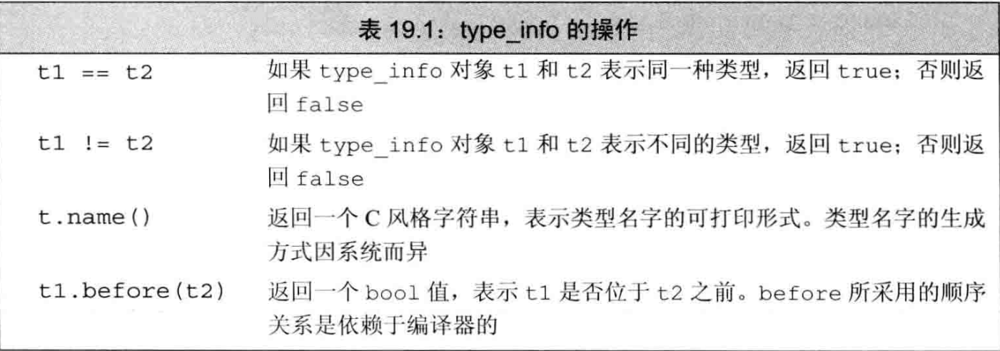

> 创建`type_info`对象的唯一途径是使用`typeid`运算符

````cpp
const char* const a = new char;
int* b = new int;
if (typeid(a) == typeid(b)) {
    println("equal, typeid:{}", typeid(a).name());
} else {
    println("not equal, ltypeid:{}, rtypeid:{}",typeid(a).name(),typeid(b).name());
}
//输出：
//not equal, ltypeid:PKc, rtypeid:Pi
````

在gcc14.1.0编译器中，P代表指针，K代表const，类的name()比较复杂，请读者自行尝试。

> [!NOTE]
>
> 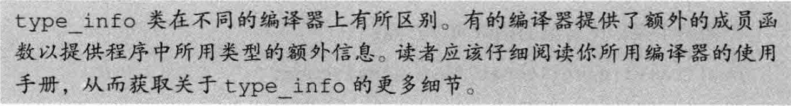


## 3. 枚举类型

**限定作用域的枚举类型**

````cpp
enum class open_mods {input, output, append};
````

**不限定作用域的枚举类型**

````cpp
enum color {red, yellow, green};
enum {floatPrec = 6, doublePrec = 10, double_doublePrec = 10};//名字是可选的
````


**枚举成员**

````cpp
enum color (red,yellow,green};//不限定作用域的枚举类型
            
enum stoplight (red,yellow,green}//错误：重复定义了枚举成员
                
enum class peppers{red,yellow,green};//正确：枚举成员被隐藏了
                
color eyes = green;//正确：不限定作用域的枚举类型的枚举成员位于有效的作用域中
                
peppers p = green;//错误：peppers的枚举成员不在有效的作用域中
                  //color::green在有效的作用域中，但是类型错误
                
color hair = color::red;//正确：允许显式地访问枚举成员
                
peppers p2 = peppers::red;//正确：使用pappers的red
````

- 默认情况下，枚举值从0开始，依次加1,也可以指定初始值。
- 枚举值不一定唯一。
- 枚举成员是`const`，初始值必须是常量表达式
- 可以作为switch语句的表达式，枚举值作为cast标签。
- 作为非类型模板形参

> [!NOTE]
>
> 不限定作用域的枚举类型成员可以隐式地转换成int，但是限定作用域的就不会。


**指定`enum`的大小**

`enum`的名字后加上冒号以及想要使用的类型：

````cpp
enum intValues : unsigned long long {
  ...
};
````

限定作用域的`enum`成员类型默认为 int，然而不限定的不存在默认类型，但是成员的潜在类型足够大。


**枚举类型的前置声明**

C++11新标准中，可以提前声明`enum`，`enum`的前置声明（无论隐式地还是显式地）必须指定其成员的大小：

````cpp
enum intValues : unsigned; //不限定作用域的，必须显式指定
enum class open_modes; //限定作用域的可以使用默认类型int
````


## 4. 类成员指针

**成员指针(pointer to member)**是指可以指向类的非静态成员的指针。

> [!NOTE]
>
> 类的静态成员不属于任何对象，因此无须特殊的指向静态成员的指针，指向静态成员的指针与普通指针没有什么区别。


#### 4.1 数据成员指针

````cpp
int foo::*p = &foo::data;//传统香烟
auto pp = &foo::data;//锐克五代
````

现在只是有名无实，只有当解引用成员指针时我们才提供对象的信息：

````cpp
foo f, *pf = &f;
auto s = foo.*p;//对象
s = pf->*p;//指针
````

成员指针访问运算符：`.*`和`->*`，它们首先解引用成员指针以得到所需的成员；然后像成员访问运算符一样，通过对象或指针获取成员。


###### 返回数据成员指针的函数

````cpp
static int foo::*getData(){
  return &foo::data;
}//foo的静态成员，返回foo类的int成员指针

int foo::*pdata = foo::getData();//获得成员指针
int mdata = mfoo.*pdata;//获得成员
````


---

#### 4.2 成员函数指针

````cpp
int (foo::*pbar)() const = &foo::bar;
//(foo::*pbar)括号必不可少，否则将被视为函数声明
//note：而且非成员函数不能使用const限定符，函数声明无效。
auto pbar = &foo::bar;
````

和普通函数指针不同的是，在成员函数和指向该成员的指针之间不存在自动转换规则：
````cpp
pbar = &foo::bar;
//必须显式地使用取地址运算符
pbar = foo::bar;
//错误：在成员函数和指针之间不存在自动转换规则
````

使用：

````cpp
foo f, *pf = &f;
(f.*pbar)();//对象调用
(pf->*pbar)();//指针调用
````

`(f.*pbar)`括号必不可少，因为**调用运算符`()`的优先级高于成员指针访问运算符`.* ->*`**。

假设去掉括号：`f.*pbar()`

则会调用名为`pbar`的函数，但`pbar`并不是一个函数，因此代码会产生错误。

> [!NOTE]
>
> 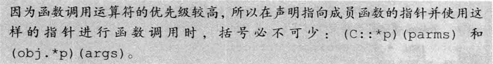


###### 成员指针的类型别名

````cpp
using barFunc =  int (foo::*)() const;
barFunc bptr = &foo::bar;
//用来声明函数
void action(barFunc = &foo::bar);
````

> [!NOTE]
>
> 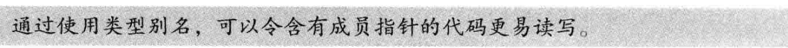


###### 成员指针函数表

````cpp
//枚举类型增强可读性
enum func {func1, func2, func3, func4};

//函数表
barFunc Menu[] = {&foo::func1,
                  &foo::func2,
                  &foo::func3,
                  &foo::func4,
                 };

//调用指定函数
foo& foo::action(func f) {
  return (this->*Menu[f])();
}

/**使用**/
foo f;
foo.action(foo::func1);
foo.action(foo::func2);
````


---

#### 4.3 将成员函数用作可调用对象

成员指针不是一个可调用对象，这样的指针不支持函数调用运算符，也不能将它传递给一个标准库算法。


###### 使用`function`生成一个可调用对象

`std::function`通过重载 `operator()` 并结合类型擦除和包装技术，实现了对成员函数指针的支持，使其可以像普通函数一样使用。

````cpp
function<bool (const string&) fcn = &string::empty;
find_if(svec.begin(), svec.end(), fcn);
//必须将函数中用于表示执行对象的隐式形参转换成显式的const string&，如果svec包含的对象是string*，那么参数也随之更改。
````

要想使用`function`，必须提供成员的调用形式。


###### 使用`mem_fn`生成一个可调用对象

和`function`一样，`mem_fn`也定义在`functional`头文件中，并且可以从成员指针生成一个可调用对象；和`function`不同的是，`mem_fn`可以根据成员指针的类型推断可调用对象的类型，而无须用户显式地指定：

````cpp
find_if(svec.begin(), svec.end(), mem_fn(&string::empty));
````

`mem_fn`生成的可调用对象可以通过对象调用，也可以通过指针调用：

````cpp
auto f = mem_fn(&string::empty);
f(svec[0]); //对象，通过.*调用
f(&svec[0]);//指针，通过->*调用
````


###### 使用`bind`生成一个可调用对象

````cpp
auto it = find_if(svec_begin(),svec.end(),
                 bind(&string::empty, _1));
//必须将函数中用于表示执行对象的隐式形参转换成显式的_1
````


## 5. 嵌套类

- 嵌套类的名字在外层类作用域中是可见的，在外层类作用域之外不可见。和其他嵌套的名字一样，嵌套类的名字不会和别的作用域中的同一个名字冲突。
- 嵌套类也使用访问限定符来控制外界对其成员的访问权限。外层类对嵌套类的成员没有特殊的访问权限，同样，嵌套类对外层类的成员也没有特殊的访问权限。
- 嵌套类在其外层类中定义了一个类型成员。和其他成员类似，该类型的访问权限由外层类决定。

> [!WARNING]
>
> 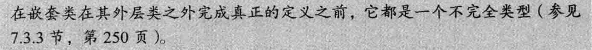

如我们所知，嵌套类是其外层类的一个类型成员，因此外层类的成员可以像使用任何其他类型成员一样使用嵌套类的名字。

和过去一样，函数返回类型不在类的作用域中（参见7.4节，第253页），因此，如果返回值类型是在类内定义的，我们必须使用作用域运算符指明作用域。比如`foo::type`。


## 6. union：一种节省空间的类

**联合(union)**是一种特殊的类。一个`union`可以有多个数据成员，但是在任意时刻只有一个数据成员可以有值。当我们给`union`的某个成员赋值之后，该`union`的其他成员就变成未定义的状态了。分配给一个`union`对象的存储空间至少要能容纳它的最大的数据成员。和其他类一样，一个`union`定义了一种新类型。

- 不能含有引用类型的成员
- 成员可以是类类型
- 默认情况下成员是`public`的
- 可以定义构造函数和析构函数
- 不能继承自其他类，也不能作为基类使用，所以不能含有虚函数

> 为`union`的一个数据成员赋值会令其他数据成员变成未定义的状态。因此，当我们使用`union`时，必须清楚地知道当前存储在`union`中的值到底是什么类型。如果我们使用错误的数据成员或者为错误的数据成员赋值，则程序可能崩溃或出现异常行为，具体的情况根据成员的类型而有所不同。


###### 匿名`union`

````cpp
union {
  char cval;
  int ival;
  double dval;
};
````

一旦我们定义了一个匿名`union`，编译器就自动地为该`union`创建一个未命名的对象，在匿名`union`的定义所在的作用域内该`union`的成员都是可以直接访问的。

> [!NOTE]
>
> 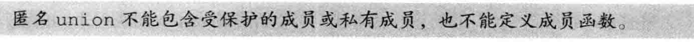


###### 含有类类型成员的`union`

对于`union`来说，要想构造或销毁类类型的成员必须执行非常复杂的操作，因此我们通常把含有类类型成员的`union`内嵌在另一个类当中。

这个类可以管理并控制与`union`的类类型成员有关的状态转换。为了追踪`union`中到底存储了什么类型的值，我们通常会定义一个独立的对象，该对象称为`union`的**判别式(discriminant)**。我们可以使用判别式辨认`union`存储的值。

一定要注意，在处理`union`中的类类型成员时，要手动调用构造函数和析构函数。


## 7. 局部类

**局部类（local class）**是定义在某个函数内的类。

> [!NOTE]
>
> 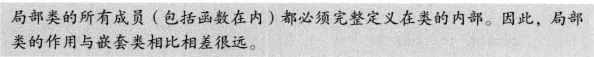

- 在局部类中不允许声明静态数据成员，因为我们没法定义这样的成员。
- 局部类只能访问外层作用域定义的类型名、静态变量以及枚举成员。
- 如果局部类定义在某个函数内部，则它不能使用该函数的普通局部变量。
- 局部类内的嵌套类也是一个局部类，必须遵循局部类的各种规定。


## 8. 固有的不可移植的特性

为了支持低层编程，C++定义了一些固有的**不可移植(nonportable)**的特性。所谓不可移植的特性是指因机器而异的特性，当我们将含有不可移植特性的程序从一台机器转移到另一台机器上时，通常需要重新编写该程序。


#### 8.1 位域

类可以将其（非静态）数据成员定义成**位域(bit-field)**,在一个位域中含有一定数量的二进制位。当一个程序需要向其他程序或硬件设备传递二进制数据时，通常会用到位域。

> [!NOTE]
>
> 

- 位域的类型必须是整形或枚举类型。
- 因为带符号位域的行为是由具体实现确定的，所以在通常情况下我们使用无符号类型保存一个位域。
- 位域的声明形式是在成员名字之后紧跟一个冒号以及一个常量表达式，该表达式用于指定成员所占的二进制位数。
- 如果可能的话，在类内部连续定义的位域压缩在同一整数的相邻位，从而提供存储压缩，这与机器相关。
- 取地址运算符（&）不能用于位域，因此任何指针都无法指向类的位域

> [!WARNING]
>
> 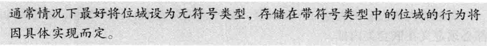

````cpp
typedef unsigned int Bit;
class File{
  Bit mode: 2;//占2位
  Bit modified: 1;//占1位
public:
  enum modes {READ = 01, WRITE = 02, EXECUTE = 03};
  //此处是八进制数
  File &open(modes);
  void close();
  void write();
  bool isRead() const;
  void setWrite();
}
````

通常使用内置的位运算符操作超过1位的位域。


---

#### 8.2 volatile 限定符

> [!WARNING]
>
> 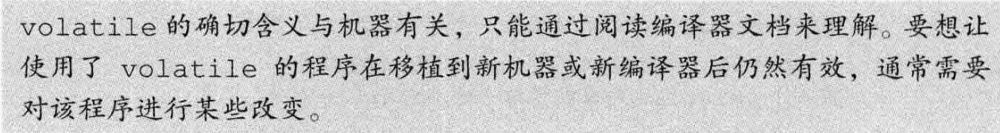

直接处理硬件的程序常常包含这样的数据元素，它们的**值由程序直接控制之外的过程控制**。例如，程序可能包含一个由系统时钟定时更新的变量。当对象的值可能在程序的控制或检测之外被改变时，应该将该对象声明为`volatile`。**关键字`volatile`告诉编译器不应对这样的对象进行优化。**

`volatile`和`const`有许多相似之处，并且可以同时存在。

但它们的一个重要区别是我们**不能使用合成的拷贝/移动构造函数以及赋值运算符初始化`volatile`对象或从`volatile`对象赋值**，这是由合成函数的参数类型导致的。

以下是自定义的`volatile`拷贝控制操作：

````cpp
class Foo {
public:
  //从一个volatile对象进行拷贝
	Foo(const volatile Foo&);
	
  //将一个volatile对象赋值给一个非volati1e对象
	Foo& operator=(volatile const Foo&);
  
	//将一个volatile对象赋值给一个volatile对象
	Foo& operator=(volatile const Foo&) volatile;
};
````


---

#### 8.3 链接指示：extern "C"

C++程序有时需要调用其他语言编写的函数，最常见的是调用C语言编写的函数。

像所有其他名字一样，其他语言中的函数名字也必须在C++中进行声明，并且该声明必须指定返回类型和形参列表。

对于其他语言编写的函数来说，编译器检查其调用的方式与处理普通C+函数的方式相同，但是生成的代码有所区别。C++使用**链接指示(linkage directive)**指出任意非C++函数所用的语言。

> [!NOTE]
>
> 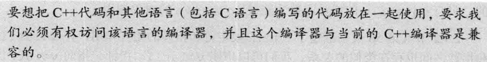

> [!note]
>
> 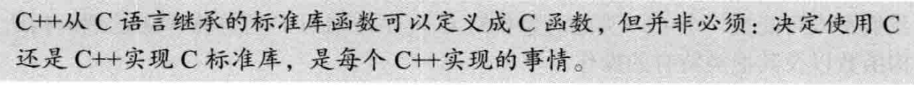


**声明一个非C++的函数**

````cpp
extern "C" size_t strlen(const char*);
extern "C" {
  int strcmp(const char*, const char*);
  char *strcat(char*, const char*);
}
````


**链接指示与头文件**

````cpp
extern "C" {
  #include <string.h>
}//对头文件中所有普通函数的声明都有效
````


**指向extern "C"函数的指针**

````cpp
void (*pf1)(int);
extern "C" void (*pf2)(int);
pf1 = pf2; //错误，类型不同
````

> [!WARNING]
>
> 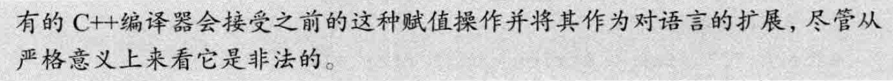


**链接指示对整个声明都有效**

````cpp
extern "C" void f1( void(*)(int) );
//extern对于f1的形参函数指针也有效
//调用时必须传入一个C函数或指向C函数的指针
````

给C++函数传入一个指向C函数的指针：

````cpp
extern "C" typedef void FC(int);
void f2(FC*);
````

